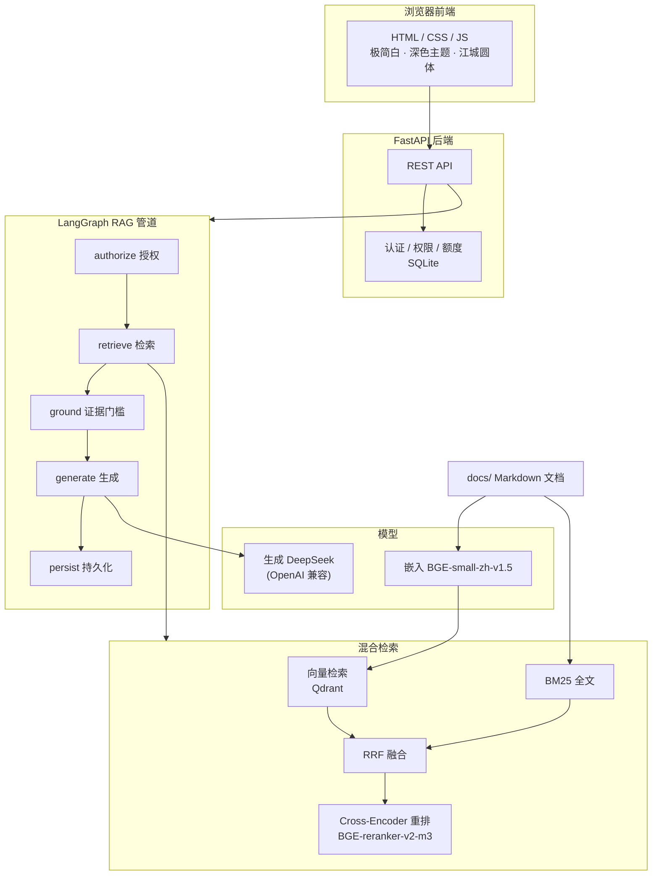

# AI Knowledge Base · RAG 知识库

一个基于 FastAPI + LangGraph RAG 的本地知识库系统，支持从 Markdown 文档中检索并生成带出处的回答。前端为原生 HTML/CSS/JavaScript，界面为极简白 + 深色双主题。

## 架构



## 技术栈

| 层 | 技术 |
| --- | --- |
| 后端框架 | FastAPI + Uvicorn |
| RAG 框架 | LangGraph（authorize → retrieve → ground → generate → persist 线性管道） |
| 向量数据库 | Qdrant（本地模式） |
| 嵌入模型 | BGE-small-zh-v1.5（fastembed） |
| 重排模型 | BGE-reranker-v2-m3（Cross-Encoder） |
| 大语言模型 | DeepSeek（OpenAI 兼容接口） |
| 前端 | 原生 HTML / CSS / JavaScript，无构建步骤 |

### 检索与反幻觉优化

- **混合检索**：向量 + BM25 → RRF 融合 → Cross-Encoder 重排 top-3
- **证据门槛**：检索分低于阈值的片段直接丢弃，无依据时诚实拒答而非编造
- **强制引用**：生成的每个事实陈述都标注来源编号，可直接跳转到对应段落
- **反幻觉工作流**：`DIFY-WORKFLOW-GUIDE.md` 提供了 grade / rewrite / verify / revise 的显式校验工作流设计，用于进一步降低幻觉

## 快速开始

### 1. 安装依赖

```powershell
python -m venv .venv
.\.venv\Scripts\Activate.ps1
pip install -r requirements.txt
```

### 2. 配置环境变量

```powershell
Copy-Item .env.example .env
```

在 `.env` 中填写 `DEEPSEEK_API_KEY` 等配置。

### 3. 准备文档并建立索引

将 Markdown 文档放入 `docs/` 后建立索引：

```powershell
python -m scripts.ingest
```

### 4. 启动服务

双击 `run_server.bat`，或执行：

```powershell
.venv\Scripts\python.exe -m uvicorn app.main:app --host 127.0.0.1 --port 8688
```

浏览器访问 <http://127.0.0.1:8688>。

## 项目结构

```text
app/                 FastAPI 后端、认证、SQLite 与 LangGraph RAG 管道
web/                 前端（HTML / CSS / JS + 江城圆体字体）
scripts/             文档索引脚本
docs/                Markdown 知识库文档
DIFY-WORKFLOW-GUIDE.md  Dify 反幻觉工作流搭建指南
.impeccable.md       设计上下文与设计决策
.env.example         环境变量模板
run_server.bat       一键启动脚本
```

## 界面预览

主界面


权限


