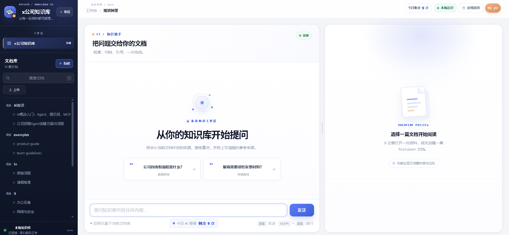

# AI Knowledge Base

一个基于 FastAPI、原生 HTML/CSS/JavaScript 和 RAG 的 Markdown AI 知识库示例项目。

## 特性

- 自然语言问答：从 Markdown 文档中检索并生成回答
- Markdown 文档管理：目录树、预览、上传和同步
- 编辑工具栏：标题、粗体、斜体、引用、列表、代码块、链接、表格
- 本地向量检索：使用 Qdrant 本地模式和 fastembed
- 简洁的响应式界面：适合桌面端和窄屏使用
- 用户注册/登录：SQLite 保存账号、会话、问答和反馈数据
- 五类知识库权限：运维、人工智能、开发、运营、HR；用户申请后由管理员审批
- 多库隔离检索：只在用户已获批的知识库内检索，文档树和文档接口也做服务端鉴权
- 混合检索链路：向量 + BM25 → RRF 融合 → Cross-Encoder 重排 top-3 → 有依据才回答并引用
- 每日 AI 咨询额度：每个用户每天最多 10 次，后端原子计数，超出返回 429
- 回答评价与持续学习：每次回答都支持 1-5 星，1-4 星必须填写至少 10 个字符的原因，并沉淀为用户专属回答策略

## 技术栈

- 后端：FastAPI + Uvicorn
- 向量数据库：Qdrant（本地模式）
- 向量模型：fastembed（BGE-small-zh-v1.5）
- 大语言模型：兼容 OpenAI API 的模型服务（默认示例为 DeepSeek）
- 前端：原生 HTML、CSS、JavaScript

## 快速开始

### 1. 安装依赖

```powershell
python -m venv .venv
.\.venv\Scripts\Activate.ps1
pip install -r requirements.txt
```

### 2. 配置环境变量

复制配置模板：

```powershell
Copy-Item .env.example .env
```

然后在 `.env` 中填写模型服务的 API Key 和相关配置。

默认还会在 `data/knowledge.db` 创建轻量级 SQLite 数据库；可通过 `DB_PATH` 修改位置，`DAILY_ASK_LIMIT` 修改每日额度（默认 10）。首次升级后请点击“重新索引”或运行 `python -m scripts.ingest`，以生成带权限标签的向量和 BM25 索引。

### 3. 权限与五类知识库

文档目录按一级目录映射到五类知识库：

- `docs/运维` → 运维
- `docs/人工智能` → 人工智能
- `docs/开发` → 开发
- `docs/运营` → 运营
- `docs/hr` → HR（也兼容 `docs/HR`）

用户注册后默认没有任何库权限，点击“我的权限”申请，管理员在“管理用户”中审批。管理员拥有全部权限。项目已附带每个库的示例文档。

### 4. 准备文档并建立索引

仓库中的 `docs/` 仅包含可公开发布的示例文档。将自己的 Markdown 文件放入本地 `docs/` 后运行：

```powershell
python -m scripts.ingest
```

或者启动网站后点击“重建索引”。

### 5. 启动服务

```powershell
uvicorn app.main:app --reload
```

浏览器访问 <http://127.0.0.1:8000>。

## 隐私与安全

本仓库是公开仓库，请不要提交以下内容：

- 公司内部制度、HR、招聘或网络安全文档
- API Key、密码、Cookie、令牌或个人信息
- `data/` 下生成的本地向量数据库
- 本地浏览器配置和调试截图

项目已通过 `.gitignore` 默认忽略内部文档内容；公开发布前仍请检查 `git status` 和提交文件列表。

## 项目结构

```text
app/                 FastAPI 后端、认证、SQLite 和 RAG 逻辑
skills/              AI 文档检索技能说明与持续学习规则
scripts/             文档索引脚本
docs/                可公开发布的示例 Markdown 文档
web/                 前端页面
.env.example         环境变量模板
```
## 界面预览


