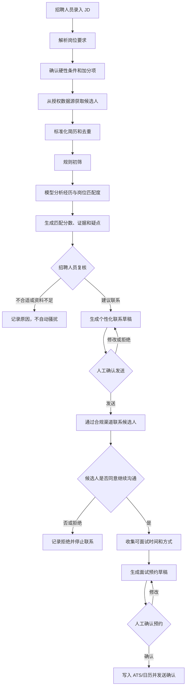
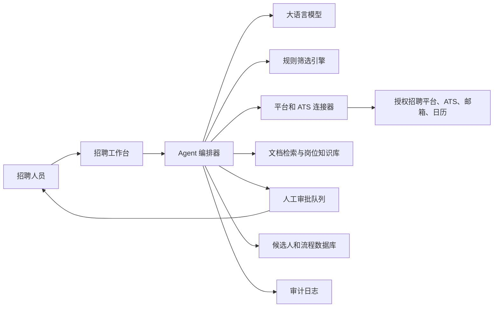
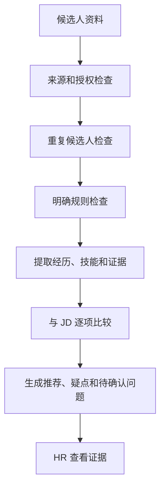
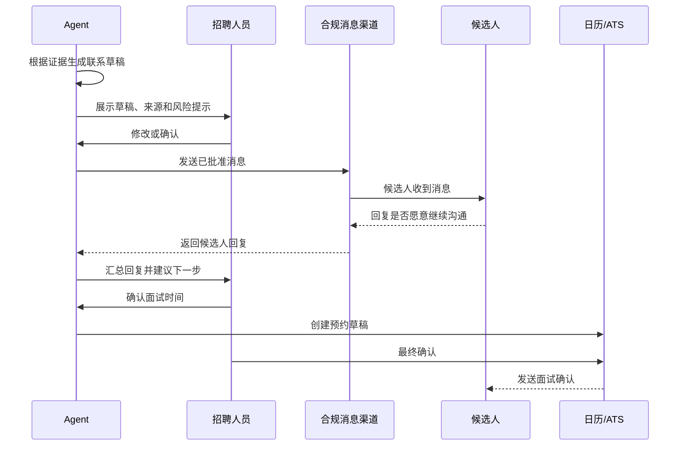

# 公司招聘 Agent 创建方案与流程

> 适用场景：根据公司 JD，从已获授权的招聘平台、企业 ATS 或候选人主动投递资料中，筛选符合条件的人选，生成二次联系内容，并在人工确认后推进面试。
>
> 重要说明：招聘涉及个人信息、就业公平和平台规则。本方案把 Agent 定位为“招聘助理和推荐系统”，不是替 HR 自动做最终录用决定。正式上线前，应结合公司所在地区法律、平台协议和法务意见进行审核。

---

## 1. 先明确目标和边界

### 1.1 这个 Agent 应该做什么

它可以帮助招聘人员：

- 读取和结构化 JD
- 从允许访问的数据源获取候选人资料
- 根据明确的岗位要求做初步匹配
- 给出匹配理由、证据和不确定项
- 生成个性化的二次沟通草稿
- 在候选人同意后收集可面试时间
- 创建面试预约草稿
- 把全过程记录到 ATS 或招聘台账

### 1.2 它不应该直接做什么

默认不允许 Agent：

- 绕过招聘平台登录、验证码、访问限制或反爬机制
- 未经授权抓取、购买或扩散候选人个人信息
- 自动批量骚扰候选人
- 仅凭模型分数自动淘汰候选人
- 根据年龄、性别、婚育、民族、籍贯、宗教、健康等非岗位必要因素筛选
- 自动代表公司承诺薪资、职位、录用或签约
- 未经人工确认自动发送面试邀请
- 把候选人简历上传到未经批准的第三方服务

### 1.3 推荐的产品定位

```text
不推荐：全自动招聘机器人

推荐：AI 招聘助理
      自动整理、匹配、起草和提醒
      人负责确认、判断和最终沟通
```

---

## 2. 总体流程图

下面是推荐的端到端流程：



如果编辑器不支持 Mermaid，可以按下面的纯文本流程理解：

```text
JD -> 解析要求 -> 获取授权候选人 -> 去重 -> 规则初筛
                                      |
                                      v
                              AI 匹配和解释
                                      |
                                      v
                              HR 人工复核
                                      |
                     +----------------+----------------+
                     |                                 |
                 不联系                             建议联系
                                                       |
                                                       v
                                            AI 起草消息，HR 确认
                                                       |
                                                       v
                                              候选人同意继续沟通
                                                       |
                                                       v
                                              预约面试并写入 ATS
```

---

## 3. 系统架构

### 3.1 推荐架构图



### 3.2 各组件负责什么

| 组件 | 职责 | 是否可以自动执行 |
|---|---|---|
| 招聘工作台 | 展示候选人、理由、草稿和审批按钮 | 由 HR 操作 |
| Agent 编排器 | 安排步骤、调用工具、控制循环 | 可以，但必须有限制 |
| 模型 | 解析文本、提取证据、生成草稿 | 可以辅助，不做最终决定 |
| 规则筛选引擎 | 判断硬性条件和权限边界 | 可以自动执行明确规则 |
| 平台连接器 | 通过授权接口读写平台数据 | 取决于授权范围 |
| 审批队列 | 保存待人工确认的动作 | 必须由人确认高风险动作 |
| 数据库 | 保存候选人、岗位、状态和来源 | 需要访问控制 |
| 审计日志 | 记录谁在何时查看、修改、联系了谁 | 应自动记录 |

### 3.3 Agent 与普通招聘系统的区别

ATS 通常负责保存候选人和管理流程；招聘 Agent 负责理解自然语言、提取信息、比较岗位要求、起草内容和调用工具。

```text
ATS：候选人数据库 + 流程管理
Agent：理解资料 + 辅助判断 + 执行受控动作
招聘工作台：让 HR 看见证据并做最终确认
```

---

## 4. 招聘平台如何接入

### 4.1 推荐的接入优先级

```text
第一优先：官方 API 或企业合作接口
    |
第二优先：招聘平台官方导出、企业 ATS 同步
    |
第三优先：候选人主动投递的简历和公开授权资料
    |
临时方案：HR 手动上传 CSV、Excel 或 PDF
    |
不推荐：绕过限制的网页自动化和批量抓取
```

“各大招聘平台”并不代表可以用同一种方式访问。每个平台可能有不同的 API、企业权限、消息限制和数据使用条款。接入前应确认：

- 是否有正式开放接口
- 企业账号是否获得相应权限
- 是否允许保存、分析和再次联系候选人
- 联系频率和消息模板是否有限制
- 候选人是否能拒绝继续联系
- 数据保存期限和删除要求是什么

### 4.2 连接器的统一接口

不同平台的数据格式不同，建议在系统内部统一成自己的结构：

```python
class RecruitmentSource:
    def list_candidates(self, query: str, page: int) -> list[dict]:
        raise NotImplementedError

    def get_candidate(self, source_candidate_id: str) -> dict:
        raise NotImplementedError

    def create_message_draft(self, source_candidate_id: str, content: str) -> str:
        raise NotImplementedError

    def send_approved_message(self, draft_id: str) -> str:
        raise NotImplementedError
```

实际项目中，每个平台分别实现一个连接器：

```text
BOSS 连接器       -> 统一候选人格式
猎聘连接器        -> 统一候选人格式
智联连接器        -> 统一候选人格式
公司 ATS 连接器   -> 统一候选人格式
手动导入连接器    -> 统一候选人格式
```

Agent 不应该直接知道每个平台的页面细节，而应该只调用统一工具，例如：

- `search_authorized_candidates`
- `get_candidate_profile`
- `create_message_draft`
- `send_approved_message`
- `get_candidate_reply`
- `create_interview_draft`

### 4.3 关于网页自动化

只有在平台明确允许、公司获得授权并完成安全评估时，才考虑网页自动化。不能把“技术上能打开网页”当成“业务上可以抓取”。尤其不要：

- 绕过验证码或登录保护
- 使用他人账号批量操作
- 隐藏真实访问来源
- 复制大量候选人资料到未授权系统
- 使用多个账号规避消息限制

如果没有官方接口，最稳妥的 MVP 是让 HR 下载或导出候选人资料，再由 Agent 在公司内部处理。

---

## 5. 如何把 JD 变成可计算的要求

### 5.1 不要只把整段 JD 丢给模型

应把 JD 拆成结构化要求：

```json
{
  "title": "后端开发工程师",
  "location": "上海或远程",
  "employment_type": "全职",
  "required": [
    {
      "item": "Python 后端开发",
      "weight": 30,
      "evidence_required": true
    },
    {
      "item": "三年以上相关项目经验",
      "weight": 20,
      "evidence_required": true
    },
    {
      "item": "能够进行数据库设计",
      "weight": 15,
      "evidence_required": true
    }
  ],
  "preferred": [
    {
      "item": "FastAPI 经验",
      "weight": 10
    },
    {
      "item": "云服务部署经验",
      "weight": 10
    }
  ],
  "must_confirm_with_human": [
    "薪资期望",
    "到岗时间",
    "工作地点接受程度"
  ]
}
```

### 5.2 硬性条件和加分项

```text
硬性条件：不满足时标记为“需要人工确认”，不要直接自动淘汰
加分项：用于排序和推荐，但不应成为绝对门槛
待确认项：简历中没有明确证据，需要联系候选人确认
禁止项：与工作能力无关的敏感属性，不得用于筛选
```

### 5.3 推荐的匹配结果

不要只给一个黑盒分数，应输出：

```json
{
  "candidate_id": "c_10086",
  "recommendation": "建议进入人工复核",
  "score": 82,
  "confidence": "medium",
  "matched": [
    {
      "requirement": "Python 后端开发",
      "evidence": "简历中提到负责 Python 服务开发 4 年"
    }
  ],
  "missing_or_unclear": [
    {
      "requirement": "数据库设计",
      "reason": "提到 MySQL 使用，但未明确是否负责设计"
    }
  ],
  "questions_to_confirm": [
    "是否接受上海办公？",
    "预计何时可以到岗？"
  ],
  "risk_flags": []
}
```

招聘人员应该能回答：“为什么推荐这个人？”而不是只看到“AI 评分 82 分”。

---

## 6. 候选人筛选流程

### 6.1 推荐的四层筛选



### 6.2 四层说明

**第一层：来源和授权检查**

记录资料来自哪里、何时获取、是否允许用于招聘和联系。

**第二层：重复候选人检查**

根据平台候选人 ID、联系方式哈希、候选人主动提供的唯一标识等去重。不要直接把身份证号作为普通业务字段到处复制。

**第三层：明确规则检查**

例如岗位明确要求必须会某项技术、必须能在某地区工作。规则应公开、可解释，并由 HR 确认。

**第四层：模型辅助分析**

模型提取简历证据并逐项对照 JD。没有证据时输出“未知”，不能把“可能会”写成“已经具备”。

### 6.3 推荐、拒绝和待确认

不要只有“通过/不通过”两个状态，建议使用：

```text
推荐联系：证据充分，符合度较高
建议复核：部分符合，但存在关键疑点
资料不足：无法根据现有资料判断
暂不推荐：与明确岗位要求差距较大，需记录依据
已联系：已进入沟通阶段
候选人拒绝：停止后续联系
已安排面试：预约完成
```

尤其是“资料不足”不等于“不合格”。这能减少模型因信息缺失造成的误判。

---

## 7. 二次联系和面试确认流程

### 7.1 推荐的人工确认流程



### 7.2 联系消息应该包含什么

推荐消息结构：

1. 说明自己代表哪家公司和岗位。
2. 说明为什么联系，引用候选人公开或主动提供的相关经历。
3. 简要介绍岗位，不夸大、不承诺未确认的待遇。
4. 询问候选人是否愿意了解更多。
5. 明确候选人可以拒绝后续联系。

### 7.3 消息草稿示例

```text
您好，我是 XX 公司的招聘负责人。我们正在招聘后端开发工程师。

根据您公开/主动提供的经历，您曾参与 Python 服务开发，这与我们岗位的技术方向比较相关。这个岗位主要负责内部业务系统和 API 服务建设，工作地点为上海/远程，具体安排可以进一步沟通。

想请问您近期是否愿意了解一下这个机会？如果您暂时不考虑，也可以直接告诉我，我们会停止后续联系。
```

### 7.4 不应让 Agent 自动承诺的内容

- 最终薪资和股票待遇
- 一定能够录用
- 面试必然通过
- 远程、签证、福利等尚未确认的条件
- 候选人的隐私资料已经被谁查看
- 公司对候选人的内部评价

### 7.5 面试预约

建议 Agent 只做“时间收集和预约草稿”：

```text
候选人提供可用时间
  -> Agent 检查面试官日历空闲
  -> 生成候选时间选项
  -> HR 确认岗位、面试官和会议链接
  -> 创建日历事件
  -> 发送确认和改期方式
```

如果涉及多个面试官、跨时区、机密会议链接或高管岗位，必须保留人工确认。

---

## 8. Agent 需要哪些工具

### 8.1 推荐的工具清单

| 工具 | 作用 | 风险级别 | 默认策略 |
|---|---|---:|---|
| `parse_job_description` | 解析 JD | 低 | 自动 |
| `search_authorized_candidates` | 搜索授权候选人 | 中 | 自动，限范围 |
| `get_candidate_profile` | 查看候选人资料 | 中 | 自动，记录审计 |
| `compare_candidate_to_jd` | 生成匹配分析 | 中 | 自动，需 HR 复核 |
| `create_message_draft` | 生成联系草稿 | 低 | 自动 |
| `send_approved_message` | 发送已批准消息 | 高 | 必须人工确认 |
| `get_candidate_reply` | 获取候选人回复 | 中 | 自动，遵循授权 |
| `find_interview_slots` | 查询空闲时间 | 中 | 自动，限制日历范围 |
| `create_interview_draft` | 生成面试预约草稿 | 中 | 自动 |
| `confirm_interview` | 创建最终预约并通知 | 高 | 必须人工确认 |
| `update_ats_status` | 更新候选人状态 | 中 | 按权限执行并记录 |
| `delete_candidate_data` | 删除候选人资料 | 高 | 管理员确认 |

### 8.2 工具白名单示意

```python
READ_ONLY_TOOLS = {
    "search_authorized_candidates",
    "get_candidate_profile",
    "get_candidate_reply",
    "find_interview_slots",
}

APPROVAL_REQUIRED_TOOLS = {
    "send_approved_message",
    "confirm_interview",
    "update_ats_status",
    "delete_candidate_data",
}
```

Agent 不能通过模型输出任意 Python 函数名，也不能因为候选人消息中的文字就自动获得管理员权限。

### 8.3 如果使用 MCP

可以把招聘平台、ATS、日历和企业知识库分别封装成 MCP Server：

```text
招聘平台 MCP Server
  - 搜索授权候选人
  - 读取候选人资料
  - 创建联系草稿

ATS MCP Server
  - 查询岗位
  - 更新候选人阶段
  - 写入面试反馈

日历 MCP Server
  - 查询面试官空闲时间
  - 创建预约草稿

企业知识库 MCP Server
  - 查询公司介绍
  - 查询福利和招聘流程
```

MCP 只是连接协议，不会自动解决招聘合规问题。每个 Server 仍需要独立设计权限、日志和数据范围。

---

## 9. 数据结构设计

### 9.1 岗位表

```json
{
  "job_id": "job_backend_001",
  "title": "后端开发工程师",
  "department": "技术部",
  "location": ["上海", "远程"],
  "required_skills": ["Python", "API 开发", "数据库"],
  "preferred_skills": ["FastAPI", "云部署"],
  "status": "open",
  "created_by": "hr_001"
}
```

### 9.2 候选人表

```json
{
  "candidate_id": "candidate_10086",
  "source": "authorized_platform",
  "source_candidate_id": "platform_abc",
  "consent_status": "contact_allowed",
  "profile": {
    "name": "候选人姓名",
    "skills": ["Python", "MySQL"],
    "experience_summary": "..."
  },
  "source_updated_at": "2026-09-08T10:00:00+08:00",
  "retention_until": "2027-09-08T10:00:00+08:00"
}
```

### 9.3 匹配分析表

```json
{
  "job_id": "job_backend_001",
  "candidate_id": "candidate_10086",
  "recommendation": "needs_review",
  "score": 82,
  "confidence": "medium",
  "evidence": [
    {
      "requirement": "Python",
      "status": "matched",
      "source_quote": "负责 Python API 服务开发"
    }
  ],
  "missing_information": ["是否接受上海办公"],
  "generated_at": "2026-09-08T10:10:00+08:00",
  "reviewed_by": null
}
```

### 9.4 必须保存的审计字段

- 数据来源和获取时间
- 候选人授权状态
- 谁查看过候选人资料
- 模型版本和提示词版本
- Agent 调用了哪些工具
- 筛选结果和证据
- 谁批准了消息发送
- 消息发送时间和渠道
- 候选人是否拒绝后续联系
- 数据删除和保留记录

---

## 10. 推荐的实现方式

### 10.1 初学者 MVP：先不接招聘平台

第一版建议使用 HR 手动导入的匿名或测试数据：

```text
CSV/Excel/PDF 简历
    -> 本地导入
    -> JD 结构化
    -> 规则筛选
    -> AI 匹配分析
    -> HR 复核列表
    -> 只生成联系草稿
```

这样可以先验证筛选质量和工作流程，不会一开始就面对平台接口、批量消息和个人信息风险。

### 10.2 生产版技术栈示例

| 层 | 可选技术方向 |
|---|---|
| 前端工作台 | React、Vue 或公司现有后台系统 |
| Agent 服务 | Python + FastAPI，或 TypeScript + Node.js |
| 异步任务 | Celery、Redis Queue 或同类队列 |
| 数据库 | PostgreSQL 或公司现有数据库 |
| 文件存储 | 加密对象存储，设置访问期限 |
| 搜索 | PostgreSQL 全文搜索、Elasticsearch 或向量数据库 |
| 模型 | 公司批准的模型 API 或私有部署模型 |
| 身份权限 | 企业 SSO、RBAC、最小权限 |
| 审计 | 结构化日志 + 不可随意修改的审计记录 |
| 日历和 ATS | 官方 API 或企业授权连接器 |

### 10.3 不建议一开始使用浏览器自动化

浏览器自动化会增加：

- 平台封禁风险
- 密码和 Cookie 泄露风险
- 验证码和页面变化导致的不稳定
- 难以审计的批量操作
- 违反平台服务条款的可能

如果平台没有接口，先使用官方导出或 HR 手动导入，而不是直接模拟人操作。

---

## 11. Agent 主循环设计

招聘 Agent 的循环应该是有限的、可审计的：

```python
MAX_STEPS = 8

TOOLS = {
    "search_authorized_candidates": search_authorized_candidates,
    "get_candidate_profile": get_candidate_profile,
    "compare_candidate_to_jd": compare_candidate_to_jd,
    "create_message_draft": create_message_draft,
    "find_interview_slots": find_interview_slots,
}

APPROVAL_REQUIRED = {
    "send_approved_message",
    "confirm_interview",
}


for step in range(MAX_STEPS):
    response = call_model(messages, tools=list(TOOLS))

    if response.is_final:
        return response.text

    for call in response.tool_calls:
        if call.name in APPROVAL_REQUIRED:
            return {
                "status": "waiting_for_human_approval",
                "action": call.name,
                "arguments": call.arguments,
            }

        if call.name not in TOOLS:
            raise PermissionError("工具不在白名单中")

        arguments = validate_tool_arguments(call.name, call.arguments)
        result = TOOLS[call.name](**arguments)
        record_audit_log(call, result)
        messages.append(tool_result_message(call, result))
else:
    return {"status": "stopped", "reason": "超过最大步骤数"}
```

关键原则：

- Agent 可以提出动作，但高风险动作只生成审批任务。
- 只有批准后的独立服务才能发送消息或创建面试。
- 每个工具调用都要记录日志。
- 达到最大步数、超时或连续错误时自动停止。

---

## 12. 招聘 Agent 的提示词模板

```text
你是公司的招聘助理，不是最终招聘决策者。

你的任务：根据岗位要求，整理候选人资料，输出有证据的匹配分析，并为招聘人员生成联系草稿。

工作规则：
1. 只能使用授权数据源和当前任务提供的资料。
2. 逐项比较岗位要求和候选人证据。
3. 简历未提及的能力必须标记为 unknown，不得推断为具备或不具备。
4. 不得使用年龄、性别、婚育、民族、籍贯、宗教、健康等非岗位必要信息进行评价。
5. 不得自动做最终录用或淘汰决定。
6. 不得自动发送消息；只能生成草稿并等待招聘人员确认。
7. 候选人表示拒绝或不希望继续联系后，必须停止后续联系。
8. 不得承诺未经确认的薪资、职位、福利、远程安排或录用结果。

输出格式：
- 推荐状态：推荐联系 / 建议复核 / 资料不足 / 暂不推荐
- 匹配要点：逐项列出 JD 要求和候选人证据
- 缺失信息：需要进一步确认的内容
- 风险提示：隐私、授权、重复联系或其他风险
- 联系草稿：礼貌、简洁、允许候选人拒绝后续联系
- 下一步：等待 HR 复核，不得直接发送
```

---

## 13. 联系流程中的安全规则

### 13.1 反骚扰规则

```text
每位候选人记录最近联系时间
同一岗位设置最大联系次数
候选人拒绝后进入“停止联系”名单
连续未回复不应无限追发
每天设置平台和公司的发送上限
所有消息先经过模板和敏感信息检查
```

### 13.2 候选人拒绝后的处理

候选人表达“不考虑”“请不要再联系”“暂时不看机会”等意思时，Agent 应：

1. 识别为拒绝或停止联系意愿。
2. 礼貌回复一次确认。
3. 写入拒绝或停止联系状态。
4. 停止该岗位和相关岗位的自动联系，具体范围按公司规则执行。
5. 不把拒绝原因当作负面人格评价。

### 13.3 敏感信息处理

简历中可能出现身份证号、住址、照片、婚育、健康和联系方式等信息。建议：

- 只收集完成招聘所需的信息
- 对不必要字段脱敏或不进入模型上下文
- 模型供应商和存储系统签署公司认可的数据协议
- 传输和存储加密
- 使用角色权限限制 HR、面试官和管理者可见范围
- 设置保留期限和删除流程

---

## 14. 评测和验收标准

上线前至少准备一批经过 HR 标注的历史样本，但要脱敏。评测不只看“推荐了多少人”，还要看：

| 指标 | 含义 |
|---|---|
| 证据准确率 | 匹配结论是否有简历原文依据 |
| 漏选率 | 合适候选人是否被错误忽略 |
| 错误推荐率 | 不符合要求的人是否被过度推荐 |
| 人工采纳率 | HR 是否愿意接受 Agent 的建议 |
| 消息修改率 | HR 需要修改联系草稿的比例 |
| 候选人回复率 | 合规联系后的有效回复比例 |
| 误联系率 | 是否联系了不应联系的人 |
| 停止联系遵守率 | 候选人拒绝后是否完全停止 |
| 工具失败率 | 平台、日历、ATS 调用是否稳定 |
| 审计完整率 | 关键动作是否都有日志 |

### 14.1 必测异常场景

- 候选人资料重复
- 简历是图片，无法提取文字
- JD 本身有冲突要求
- 平台 API 超时或返回权限错误
- 候选人资料已撤回
- 候选人拒绝继续联系
- 候选人要求删除资料
- 模型把“熟悉”误判为“精通”
- 候选人消息诱导 Agent 越权
- Agent 试图直接调用发送消息工具

---

## 15. 分阶段开发计划

### 阶段 0：业务和合规确认

交付物：

- 招聘流程图
- JD 字段标准
- 数据来源清单
- 平台授权和接口清单
- 敏感数据清单
- 人工审批节点
- 删除和停止联系流程

### 阶段 1：离线筛选 Demo

范围：

- HR 手动上传脱敏简历
- 解析 JD
- 规则筛选
- 模型生成匹配证据
- HR 查看和标记结果

暂时不接平台，不发消息。

### 阶段 2：招聘工作台

增加：

- 候选人列表和筛选状态
- JD 与候选人对比页面
- 证据和不确定项展示
- HR 批量标记和备注
- 审计日志

### 阶段 3：官方平台或 ATS 接入

增加：

- 官方 API 连接器
- 候选人去重
- 增量同步
- 数据来源和授权状态
- 错误重试和限流

### 阶段 4：联系草稿和人工审批

增加：

- 个性化消息草稿
- 发送前预览
- HR 修改和批准
- 候选人拒绝后的停止联系
- 联系记录和发送上限

### 阶段 5：面试预约

增加：

- 候选人可用时间收集
- 面试官日历查询
- 面试安排草稿
- HR 确认后创建日历事件
- 改期和取消流程

### 阶段 6：评测和生产化

增加：

- 脱敏历史样本评测
- 模型和提示词版本管理
- 监控、告警和成本统计
- 权限分级
- 数据删除和导出
- 定期公平性和误判复查

---

## 16. 一个可落地的最小版本

如果你现在就要开始，建议做下面这个版本：

```text
输入：一个 JD + 一批 HR 手动导入的脱敏简历

Agent 能力：
1. 解析 JD
2. 提取候选人技能和经历
3. 逐项比较并给出证据
4. 标记推荐联系、建议复核、资料不足
5. 生成二次联系草稿
6. 等待 HR 点击确认

Agent 不能：
1. 自动从网站批量抓取
2. 自动发送消息
3. 自动淘汰候选人
4. 修改或删除原始简历
5. 处理未授权的敏感个人信息
```

这个版本已经能验证最重要的价值：是否减少 HR 阅读简历和准备沟通内容的时间，同时保留人的判断和平台合规边界。

---

## 17. 最终检查清单

### 业务

- [ ] JD 已拆成硬性条件、加分项和待确认项
- [ ] 每个推荐结果都有证据
- [ ] 资料不足不会被自动当作不合格
- [ ] HR 可以查看、修改和撤销 Agent 建议

### 平台

- [ ] 数据来源有明确授权
- [ ] 使用官方 API、导出或企业 ATS
- [ ] 没有绕过验证码、登录限制或平台风控
- [ ] 联系频率、消息范围和保存期限符合平台规则

### 安全

- [ ] 高风险工具需要人工确认
- [ ] 工具使用白名单
- [ ] Agent 有最大步数、超时和重试限制
- [ ] 文件、数据库和日历权限为最小权限
- [ ] 所有重要动作都有审计日志

### 候选人权益

- [ ] 候选人知道联系方和岗位来源
- [ ] 候选人可以拒绝后续联系
- [ ] 拒绝后会停止联系
- [ ] 支持资料删除或更正请求
- [ ] 不使用与工作能力无关的敏感属性筛选

### 上线

- [ ] 先使用脱敏历史数据测试
- [ ] 先只生成推荐和草稿，不自动发送
- [ ] HR 验收准确率和误判率
- [ ] 小范围灰度后再扩大范围
- [ ] 定期复查模型、提示词、平台规则和法律要求

---

## 18. 一句话总结

**招聘 Agent 最适合做“找资料、做整理、给证据、写草稿、提提醒”，而不是替公司自动决定谁被录用、自动群发消息或绕过招聘平台规则。**

最稳妥的落地路径是：

```text
脱敏简历离线 Demo
 -> HR 工作台
 -> 官方平台/ATS 接入
 -> 联系草稿
 -> 人工确认发送
 -> 候选人同意后预约面试
 -> 评测、审计和逐步自动化
```
