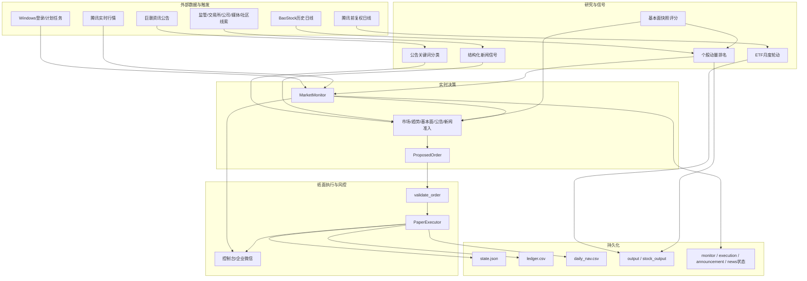
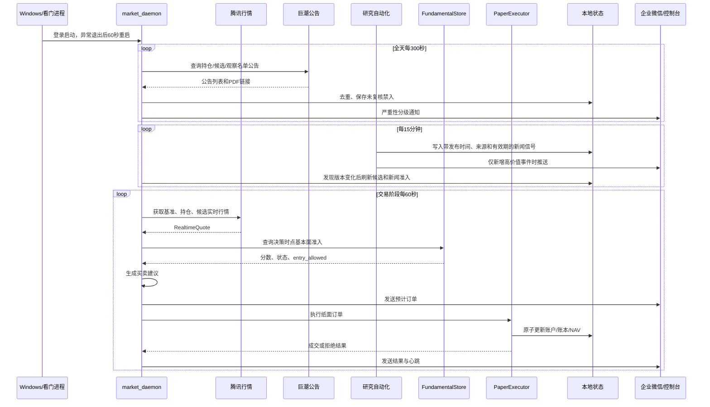
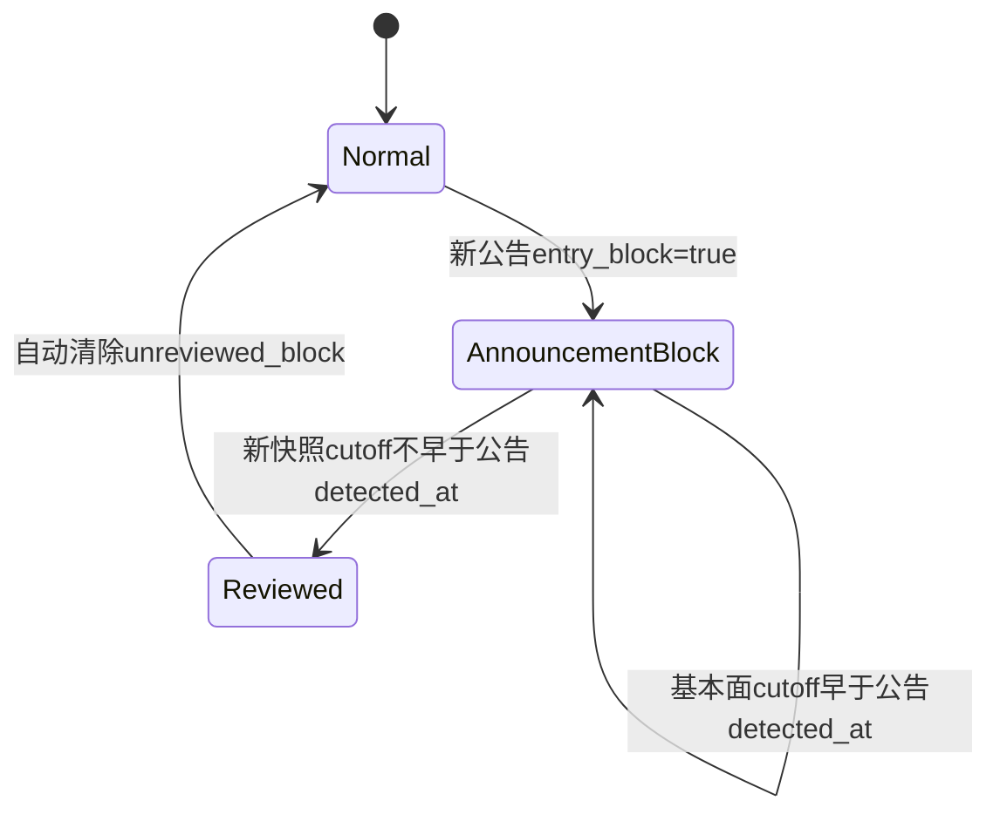
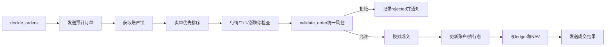

# A股纸面量化系统：详细设计开发文档

> 文档版本：v1.1  
> 源码基线：当前工作区，审计截止 2026-07-20 00:38（Asia/Shanghai）  
> 运行边界：`PAPER_ONLY`，不连接券商，不产生真实订单  
> 适用对象：产品负责人、量化研究、开发、测试、运维与审计人员

---

## 文档说明

本文以项目源码、配置、测试、现有说明和运行期状态文件为事实来源，完整描述项目做什么、为什么这样设计、每项功能如何实现、如何开发测试、如何部署运维，以及当前已知限制。

截至本次审计：

- 当前工作区共有24个Python文件、约7,741行（含测试）。
- 使用项目当前 Python 环境执行 `python -m unittest discover -v`，44个测试全部通过。
- `scripts/check_system.ps1` 的21项运行健康检查全部为 `OK`。
- 当前系统仅供研究和纸面模拟，不构成收益承诺、投资建议或真实交易指令。
- 如果本文与实际代码不一致，以源码、测试和运行日志为准，并应及时更新本文。

## 目录

- [1. 项目概述](#1-项目概述)
- [2. 功能全景](#2-功能全景)
- [3. 总体架构](#3-总体架构)
- [4. 代码与目录结构](#4-代码与目录结构)
- [5. ETF轮动回测设计](#5-etf轮动回测设计)
- [6. 个股轮动回测设计](#6-个股轮动回测设计)
- [7. 基本面研究与评分设计](#7-基本面研究与评分设计)
- [8. 官方公告雷达设计](#8-官方公告雷达设计)
- [9. 实时监控守护进程设计](#9-实时监控守护进程设计)
- [10. 纸面执行与统一风控](#10-纸面执行与统一风控)
- [11. 数据与持久化设计](#11-数据与持久化设计)
- [12. 配置项参考](#12-配置项参考)
- [13. 开发与运行指南](#13-开发与运行指南)
- [14. Windows部署与运维](#14-windows部署与运维)
- [15. 测试与质量保证](#15-测试与质量保证)
- [16. 安全与合规边界](#16-安全与合规边界)
- [17. 异常处理与恢复](#17-异常处理与恢复)
- [18. 现状审计与已知限制](#18-现状审计与已知限制)
- [19. 演进路线图](#19-演进路线图)
- [20. 验收清单](#20-验收清单)
- [附录A：命令速查](#附录a命令速查)
- [附录B：核心类与函数索引](#附录b核心类与函数索引)
- [附录C：术语表](#附录c术语表)

---

## 1. 项目概述

### 1.1 项目做什么

本项目是一个面向约 5 万元小资金账户的 A 股量化研究与纸面交易系统。它将以下能力连接为一条本地、可重复、可追踪的工作流：

1. 从公开数据源下载 ETF 和股票历史行情。
2. 运行 ETF 月度轮动和个股月度轮动回测。
3. 对当前个股候选叠加带证据、带时间戳的基本面研究。
4. 24 小时轮询巨潮资讯官方公告并进行风险分类。
5. 每15分钟接收公开来源研究自动化生成的结构化新闻信号，按证据、置信度、阶段和影响度评分。
6. 交易时段持续读取实时行情，检查市场、持仓与候选。
7. 在满足条件时写入纸面买卖，不连接真实券商。
8. 记录账户、成交账本、每日净值、通知状态和运行日志。
9. 通过企业微信群机器人发送机会、风险、成交和故障提醒。

一句话定位：**把研究模型、实时风险、基本面与新闻准入、纸面执行、通知和审计整合成一个默认安全失败的本地量化系统。**

### 1.2 设计目标

- 适配 5 万元级小资金，显式处理整手、最低佣金和有限分散度。
- 把回测研究与盘中执行分离，避免研究脚本直接修改账户。
- 对行情过期、数据缺失、来源异常、重复订单等情况默认不交易。
- 基本面信息遵守 Point-in-Time 原则，避免未来信息泄漏。
- 重大公告先阻止新买入，再等待人工或基本面智能体复核。
- 新闻信号只有在来源、时间、置信度和事件阶段可核验时才参与排序或禁入；社区内容仅作线索。
- 所有自动买卖均可通过本地文件、日志和通知还原。

### 1.3 明确不做什么

- 不连接真实券商账户。
- 不接收或保存券商账号、密码、验证码。
- 不通过企业微信消息反向触发买卖。
- 不提供收益保证或个性化投资建议。
- 不具备券商级部分成交、撤单、成交回报和实盘对账状态机。
- 不把今天的基本面结论注入过去的历史回测。
- 不把公告标题关键词匹配等同于公告全文核验。

### 1.4 使用者与场景

| 角色 | 主要任务 | 入口 |
|---|---|---|
| 量化研究 | 重跑回测、比较参数、检查成本与回撤 | `quant_etf.py`、`stock_quant.py` |
| 基本面研究 | 创建证据快照、维护来源、检查准入 | `fundamental_agent.py` |
| 模拟盘运营 | 观察候选、接收风险和纸面成交 | `market_daemon.py`、`paper_account/` |
| 开发测试 | 修改模块、补充测试、验证配置兼容 | `quant_system/`、`test_*.py` |
| 运维审计 | 检查进程、Webhook、日志和状态 | `scripts/check_system.ps1` |

---

## 2. 功能全景

| 功能域 | 功能 | 实现位置 |
|---|---|---|
| ETF研究 | 五只 ETF 月度轮动、风险过滤、稳健性测试 | `quant_etf.py` |
| 个股研究 | 沪深300当前成分股过滤、动量排名、月度回测 | `stock_quant.py` |
| 行情采集 | 腾讯前复权日线、腾讯实时行情、BaoStock历史日线 | `quant_etf.py`、`realtime.py`、`stock_quant.py` |
| 数据质量 | OHLCV完整性、日期、价格关系、极端收益检查 | `quant_system/data_quality.py` |
| 基本面 | 时点快照、财务评分、事件评分、硬风险禁入 | `quant_system/fundamentals.py` |
| 基本面CLI | 生成研究模板、评估一个或多个快照 | `fundamental_agent.py` |
| 公告监控 | 巨潮官方公告、关键词规则、分级、去重、禁入 | `quant_system/announcement_monitor.py` |
| 新闻信号 | 72小时时点信号、证据/阶段加权、硬风险和打板观察 | `quant_system/news_signals.py` |
| 实时监控 | 阶段调度、候选池、趋势、风险、心跳 | `market_daemon.py` |
| 纸面决策 | 盘中买入、成本止损、移动止损、趋势退出 | `market_daemon.py` |
| 纸面执行 | T+1、整手、现金、费用、滑点、账本、NAV | `quant_system/paper_execution.py` |
| 统一风控 | 证券权限、陈旧行情、仓位、换手、日亏、重复单 | `quant_system/risk.py` |
| 通知 | 控制台、企业微信、Windows HTTPS回退 | `quant_system/notifier.py` |
| 实验留痕 | Git版本、代码/数据哈希、配置和元数据 | `quant_system/experiment.py` |
| Windows运维 | 登录自启、异常重启、防睡眠、健康检查 | `scripts/` |

---

## 3. 总体架构

### 3.1 分层架构



### 3.2 核心设计原则

#### 安全失败

行情缺失、报价过期、历史不足、公告源异常、已确认高影响负面新闻、账户状态无效或并发冲突时，不产生新的买入订单。

#### Point-in-Time

基本面快照必须带 `cutoff_at`。决策时只选择 `cutoff_at <= as_of` 的最新快照，未来版本不能进入过去决策。

#### 研究与执行分离

回测输出只是研究产物。盘中账户只能由 `PaperExecutor` 在账户锁内修改。

#### 账户单一真源

`paper_account/state.json` 是账户唯一状态源；`ledger.csv` 和 `daily_nav.csv` 是成交与净值审计记录。

#### 显式交易现实约束

整手、最低佣金、滑点、股票印花税、高开、涨跌停、T+1、小额订单和现金约束均在对应层显式处理。

#### 可追踪

实验清单、运行日志、通知去重、公告去重、新闻来源、订单键和账户状态共同形成审计链路。

### 3.3 正常运行链路



### 3.4 外部依赖和失败策略

| 依赖 | 用途 | 失败策略 |
|---|---|---|
| 腾讯公开行情 | ETF日线、监控日线、实时行情 | 日线回退缓存；实时无可用报价时停止机会和订单 |
| BaoStock | 个股历史日线 | 跳过失败证券，输出覆盖率和质量报告 |
| 巨潮资讯 | 官方公告与PDF | 保存逐证券错误；全部失败发送 WARNING |
| 公开新闻与公司信息源 | 生成结构化新闻信号 | 登录墙、反爬或不可达时保持缺失/旧信号状态，不把传闻当事实 |
| 企业微信群机器人 | 强制出站通知 | 常驻程序缺少Webhook时拒绝启动；自动化仅在返回 `errcode=0` 时算成功 |
| Windows任务计划 | 登录自启、进程重启 | 无权限时回退用户启动目录快捷方式 |
| 本地文件系统 | 缓存、账户、账本、日志 | 文件锁、单实例、临时文件加原子替换 |

---

## 4. 代码与目录结构

### 4.1 目录结构

```text
同花顺/
├─ config/
│  ├─ monitor.json
│  └─ universe_csi300_20260717.csv
├─ data/                         # 行情缓存、基本面快照，默认不入Git
│  └─ news_signals/latest.json   # 72小时结构化新闻信号
├─ output/                       # ETF研究结果，默认不入Git
├─ stock_output/                 # 个股研究结果，默认不入Git
├─ paper_account/
│  ├─ state.json                 # 唯一账户状态源
│  ├─ ledger.csv                 # 纸面成交账本
│  ├─ daily_nav.csv              # 每日净值
│  └─ README.md
├─ quant_system/
│  ├─ announcement_monitor.py
│  ├─ data_quality.py
│  ├─ experiment.py
│  ├─ fundamentals.py
│  ├─ notifier.py
│  ├─ news_signals.py
│  ├─ paper_execution.py
│  ├─ realtime.py
│  └─ risk.py
├─ scripts/
│  ├─ start_market_daemon.ps1
│  ├─ register_market_daemon_task.ps1
│  ├─ send_wecom_report.py
│  └─ check_system.ps1
├─ quant_etf.py
├─ stock_quant.py
├─ fundamental_agent.py
├─ market_daemon.py
├─ test_*.py
└─ requirements.txt
```

### 4.2 顶层入口职责

| 文件 | 职责 | 主要输出 |
|---|---|---|
| `quant_etf.py` | ETF下载、信号、模拟调仓、指标、稳健性 | `output/` |
| `stock_quant.py` | 股票池、历史下载、技术排名、个股回测、基本面覆盖 | `stock_output/` |
| `fundamental_agent.py` | 基本面模板生成和快照评分CLI | `data/fundamentals/`或标准输出 |
| `market_daemon.py` | 公告、新闻信号、行情、盘中决策、执行编排、通知和日志 | `paper_account/`运行态 |

### 4.3 `quant_system` 模块职责

| 模块 | 职责 |
|---|---|
| `announcement_monitor.py` | 巨潮客户端、规则分类、公告去重和未复核禁入 |
| `data_quality.py` | OHLCV数据质量检查 |
| `experiment.py` | Git修订、代码/数据哈希和实验清单 |
| `fundamentals.py` | 时点基本面解析、评分、存储和准入 |
| `notifier.py` | 控制台、企业微信与组合通知器 |
| `news_signals.py` | 新闻时点过滤、证据/置信度/阶段评分、硬风险和打板候选识别 |
| `paper_execution.py` | 账户锁、模拟成交、账本和NAV |
| `realtime.py` | 腾讯代码映射、响应解析和批量报价 |
| `risk.py` | 主板权限、信号新鲜度和订单前置风控 |

### 4.4 版本库边界

`.gitignore` 排除了：

- `.deps/`、`__pycache__/`、`tmp/`
- `data/`
- `output/`
- `stock_output/`
- 监控日志、锁、执行态、公告态、新闻信号和公告触发JSONL

因此，行情、回测结果、基本面快照和多数运行态不能依赖 Git 恢复，应另做备份和实验版本管理。

---

## 5. ETF轮动回测设计

### 5.1 资产池

| 代码 | 名称 | 类型 |
|---|---|---|
| `510300` | 沪深300ETF | 风险资产/基准 |
| `510500` | 中证500ETF | 风险资产 |
| `159915` | 创业板ETF | 风险资产 |
| `510880` | 红利ETF | 风险资产 |
| `511010` | 国债ETF | 防守资产 |

### 5.2 默认策略参数

`StrategyConfig` 当前默认值：

| 参数 | 默认值 |
|---|---:|
| 初始资金 | 50,000元 |
| 起始日期 | 2016-01-01 |
| 动量周期 | 63、126、252交易日 |
| 趋势周期 | 200交易日 |
| 持仓槽位 | 2 |
| 整手 | 100份 |
| 佣金 | 万2.5，最低5元 |
| 滑点 | 万5 |
| 波动惩罚 | 0.10 |
| 最小调仓金额 | 1,000元 |
| 最大追涨高开 | 4% |

### 5.3 行情下载与对齐

`fetch_tencent_daily()` 调用腾讯前复权日线接口：

- 每次最多请求 640 条。
- 最多向前分页 20 次。
- 以日期去重并按时间升序排列。
- 返回 `open/close/high/low/volume`。
- `load_prices()` 默认从 2010-01-01 开始抓取并缓存到 `data/{symbol}.csv`。

多资产字段通过 `aligned_field()` 对齐，最多前向填充 3 个交易日，之后删除仍缺失的日期。

### 5.4 月末信号

`month_end_dates()` 只返回完整月份的最后一个交易日。索引最后一个日期即使处于月末，也不会自动当成完整月信号日。

信号流程：

1. 计算 63、126、252 日收益率。
2. 计算 63 日日收益年化波动率。
3. 计算 200 日移动均线。
4. 510300 信号日收盘必须高于自身 MA200，否则完全风险关闭。
5. 风险 ETF 必须高于自身 MA200，且 126 日收益为正。
6. 按综合分排序，选择前两个槽位。
7. 槽位不足时用 511010 补足；两个防守槽位可合并为100%防守。

评分公式：

```text
ETF_score = mean(R63, R126, R252)
            - 0.10 × annualized_volatility_63d
```

### 5.5 次日开盘调仓

信号在索引中的下一交易日开盘执行。

执行规则：

- 两个槽位等权。
- 先卖后买。
- 风险 ETF 开盘相对信号日收盘高开超过 4% 时，该槽位临时转为 511010。
- 买入价为开盘价加滑点，卖出价为开盘价减滑点。
- 目标份额向下取整为100份整数手。
- 现金不足时按100份逐步缩减买入数量。
- 非清仓卖出小于1,000元时跳过。
- 买入小于1,000元时跳过。

ETF 佣金：

```text
commission = max(5, notional × 0.00025)
```

ETF 回测不计股票卖出印花税。

### 5.6 回测指标

`calculate_metrics()` 输出：

- 起止日期、初始和期末权益
- 累计收益、年化收益、510300基准年化
- 年化波动、零无风险利率夏普
- 最大回撤
- 月度盈利率
- 滚动12个月正收益率
- 区块Bootstrap未来12个月正收益估计
- 订单数、费用、年化换手

Bootstrap 使用 3 个月连续收益块进行有放回重采样，模拟 10,000 次，随机种子固定。它只是历史样本统计，不是未来获利保证。

### 5.7 稳健性与基线

稳健性组合：

- 动量：`(42,84,168)`、`(63,126,252)`、`(84,168,252)`
- 均线：150、200、250日
- 合计9组

基线版本：

- `min_rebalance_notional=0`
- `max_entry_gap=1.0`

用于衡量小额调仓限制和高开保护对结果的影响。

### 5.8 输出

| 文件 | 内容 |
|---|---|
| `metrics.json` | 主策略指标 |
| `baseline_metrics.json` | 关闭执行保护的基线指标 |
| `equity_curve.csv` | 每日权益、现金和ETF份额 |
| `trades.csv` | 逐笔模拟成交 |
| `backtest.png` | 净值和回撤图 |
| `robustness.csv` | 9组参数结果 |
| `current_state.json` | 最新信号、目标和模拟状态 |

---

## 6. 个股轮动回测设计

### 6.1 股票池

来源：`config/universe_csi300_20260717.csv`。

这是 2026-07-17 的沪深300当前成分股快照。过滤规则：

- 只允许前缀：`000/001/002/003/600/601/603/605`。
- 排除北交所、创业板、科创板、B股和其他额外权限市场。
- 排除名称中包含 `ST` 的股票。
- 当前默认 `candidate_count=300`。

> 重要：当前成分股快照回看历史存在幸存者偏差。代码会把 `survivorship_bias=true` 写入结果和实验清单。

### 6.2 历史数据

个股历史通过 BaoStock 多进程分块下载：

```text
字段：date,open,high,low,close,preclose,volume,amount
频率：日线
复权：adjustflag=2
目录：data/stocks_baostock/{code}.csv
```

默认使用 6 个进程，每个进程独立登录 BaoStock，下载自己的证券分块。

下载后执行 `validate_price_frame()`；无效文件被排除，质量结果写入 `stock_output/data_quality.csv`。

### 6.3 默认策略参数

| 参数 | 默认值 |
|---|---:|
| 初始资金 | 50,000元 |
| 回测起点 | 2021-01-01 |
| 最大持仓 | 2只 |
| 动量周期 | 20、60、120日 |
| 个股趋势 | 60日 |
| 市场趋势 | 60日 |
| 整手 | 100股 |
| 佣金 | 万2.5，最低5元 |
| 滑点 | 0.1% |
| 最小调仓金额 | 1,000元 |
| 最大高开 | 4% |
| 最大20日涨幅 | 35% |
| 最低成交额代理 | 5,000万元 |

### 6.4 技术排名

所有股票以 510300 交易日索引对齐，最多前向填充 3 个交易日。

月末流程：

1. 510300 前收必须高于其60日均线，否则当月排名为空。
2. 股票必须属于允许主板代码。
3. 股票前收必须高于自身60日均线。
4. 20日和60日收益必须为正。
5. 20日收益不得超过35%，用于排除过热。
6. 20日平均 `close × volume` 必须不低于5,000万元。
7. 对合格股票计算技术分并保留前15名。

技术分：

```text
technical_score = 0.45 × R20
                + 0.35 × R60
                + 0.20 × R120
                - 0.10 × annualized_volatility_60d
```

### 6.5 开盘调仓

- 组合权益平均分为两个槽位。
- 从排名高到低选择，最多两只。
- 开盘相对信号收盘高出4%以上时跳过。
- 一手价格加最低费用超过单槽预算时跳过。
- 买卖加入0.1%滑点。
- 先卖后买，目标数量向下取整为100股。
- 非清仓调仓或买入金额小于1,000元时跳过。
- 现金不足时逐手缩量。

涨跌停近似：

```text
普通主板阈值：9.5%
代码以3或688开头时price_limit()可返回19.5%，
但当前允许池已排除创业板和科创板。
```

买入遇近似涨停且现价贴近当日最高价时跳过；卖出遇近似跌停且现价贴近当日最低价时跳过。

### 6.6 费用

```text
佣金 = max(5, notional × 0.00025)
```

卖出印花税：

- 2023-08-28 之前：0.1%
- 2023-08-28 起：0.05%

买入无印花税。

### 6.7 当前基本面覆盖

历史回测完成后，只对最新技术排名应用基本面覆盖，不修改历史收益。

技术名次分：

```text
technical_rank_score = (候选数 - 名次 + 1) / 候选数
```

综合分：

```text
combined_rank_score = technical_rank_score
                    + 0.20 × fundamental_score / 100
```

规则：

- `entry_allowed=false` 的候选被过滤。
- 先按是否准入，再按综合分，再按原技术名次排序。
- `historical_backtest_affected` 固定为 `false`。
- 缺失、过期或无效快照写入研究队列。

### 6.8 输出

| 文件 | 用途 |
|---|---|
| `selected_universe.csv` | 实际研究股票池 |
| `data_quality.csv` | 每只股票的数据质量 |
| `metrics.json` | 回测与覆盖指标 |
| `equity_curve.csv` | 每日权益、现金、持仓数和代码 |
| `trades.csv` | 模拟成交及名称 |
| `backtest.png` | 策略、基准和回撤 |
| `fundamental_overlay.csv` | 技术名次、基本面分和准入原因 |
| `fundamental_research_queue.json` | 待补充研究候选 |
| `current_state.json` | 最新技术与基本面排序 |
| `config.json` | 本次实际配置 |
| `experiment_manifest.json` | 代码、数据、配置和版本清单 |

### 6.9 实验可复现

`write_experiment_manifest()` 记录：

- UTC创建时间
- Git `HEAD`，无提交时为 `null`
- 完整配置
- 关键代码文件 SHA-256
- 数据文件 SHA-256、大小、修改时间
- 股票池模式、快照日期、覆盖数、幸存者偏差和用途

---

## 7. 基本面研究与评分设计

### 7.1 设计目标

基本面模块读取证据快照，而不是在交易循环中实时抓取和推理。这一设计用于：

- 保持盘中决策确定性。
- 让每个重要事实保留原始来源。
- 防止未来信息泄漏。
- 让分数、组件和阻断原因可解释。

### 7.2 快照位置和选择

支持两种位置：

```text
data/fundamentals/{code}.json
data/fundamentals/{code}/*.json
```

`FundamentalStore.assess()` 会：

1. 验证文件中的代码与目标代码一致。
2. 验证存在有效 `cutoff_at`。
3. 忽略 `cutoff_at > 决策时点` 的未来快照。
4. 选择截止时间最晚的可用版本。
5. 对结构错误返回 `INVALID`。
6. 没有可用版本时按缺失策略返回 `MISSING`。

### 7.3 快照结构

| 区域 | 关键字段 | 作用 |
|---|---|---|
| 标识 | `schema_version/code/company_name/exchange` | 证券与结构版本 |
| 时点 | `cutoff_at` | 研究事实截止时间 |
| 财务期 | `period_end/period_kind/published_at` | 只使用已披露期次 |
| 财务值 | 收入、利润、现金流、现金、债务、资产等 | 财务评分 |
| 子公司 | 关系、持股、业务、重要性、风险、来源 | 穿透核查 |
| 事件 | 类别、方向、重要性、置信度、阶段、来源 | 事件评分与禁入 |
| 未决问题 | `unresolved_questions` | 留存待核验项 |

### 7.4 财务评分

只使用 `published_at <= as_of` 的财务期。最新期与此前相同 `period_kind` 的记录比较。

| 指标 | 规则 | 分值 |
|---|---|---:|
| 营业收入同比 | 增长≥10% / 非负 / 下降≤-20% / 其余 | +10 / +5 / -10 / -5 |
| 归母净利润同比 | 增长≥10%或扭亏 / 非负 / 下降≤-20% / 其余 | +15 / +7 / -15 / -7 |
| 经营现金/归母利润 | 负值 / ≥1 / ≥0.5 / 其余 | -15 / +15 / +7 / -7 |
| 流动比率 | ≥1.5 / ≥1 / <0.75 / 其余 | +10 / +4 / -10 / -4 |
| 净负债/资产 | ≤20% / ≤50% / >50% | +10 / 0 / -10 |

财务分限制在 `[-60, +60]`。

### 7.5 事件评分

基础重要性：

```text
high=20, medium=10, low=3
```

置信权重：

```text
confirmed=1.0
partly_confirmed=0.6
unverified=0.0
```

没有来源 URL 时，置信权重强制为0。

阶段权重：

| 阶段 | 权重 |
|---|---:|
| candidate | 0.25 |
| planned | 0.50 |
| approved/pending | 0.70 |
| awarded | 0.75 |
| signed | 0.90 |
| effective/completed/confirmed | 1.00 |
| resolved | 0.20 |
| cancelled | 0.00 |

事件分：

```text
event_points = materiality
             × confidence
             × stage
             × direction_sign

负面事件再乘1.25
```

事件分限制在 `[-40, +40]`。

总分：

```text
total_score = clamp(financial_score + event_score, -100, 100)
```

### 7.6 硬风险

以下情况触发硬阻断：

- 事件为负面、高重要性、至少部分核实、尚未取消或解决。
- 类别属于 `regulatory/legal/default/audit/delisting/control/safety`。
- 或事件显式 `entry_block=true` 且置信权重至少0.6。

硬风险默认只阻止新买入。持仓会收到严重预警，但默认不因单一标签自动卖出。

### 7.7 状态机

| 状态 | 条件 | 默认准入 |
|---|---|---|
| `CURRENT` | 有效、无硬风险、分数达标 | 是 |
| `MISSING` | 没有决策时点可用快照 | `warn/allow`是，`block`否 |
| `STALE` | 年龄超过14天 | `warn/allow`是，`block`否 |
| `INVALID` | 文件、代码或时间无效 | 否 |
| `HARD_BLOCK` | 已核实/部分核实高影响风险 | 否 |
| `SCORE_BLOCK` | 总分低于-20 | 否 |
| `ANNOUNCEMENT_BLOCK` | 新严重公告晚于已复核快照 | 否 |
| `DISABLED` | 监控配置关闭基本面门 | 是 |

### 7.8 CLI

```powershell
# 创建模板
python fundamental_agent.py template 600886 --name 华能国际 --exchange SSE

# 指定时点评估
python fundamental_agent.py evaluate 600886 --as-of 2026-07-19

# 多股票、严格缺失策略
python fundamental_agent.py evaluate 600886 600584 `
  --missing-policy block `
  --max-age-days 14 `
  --min-score -20
```

---

## 8. 官方公告雷达设计

### 8.1 数据源

- 证券列表：`https://www.cninfo.com.cn/new/data/szse_stock.json`
- 公告查询：`https://www.cninfo.com.cn/new/hisAnnouncement/query`
- PDF根地址：`https://static.cninfo.com.cn/`

客户端先解析证券的 `orgId`，再根据代码选择沪/深查询参数。

### 8.2 监控范围

按以下优先级去重：

1. 当前持仓
2. 活跃候选池
3. 固定观察名单

默认最多20只。

### 8.3 分类规则

| 级别 | 典型类别或关键词 | 是否可能禁入 |
|---|---|---|
| CRITICAL | 立案、重大违法、刑事、退市、违约/破产、重大事故、控制权异常 | 是 |
| WARNING | 处罚、诉讼、冻结、质押担保、减持、预亏、审计、问询、项目终止 | 一般否 |
| INFO | 中标、合同、预增、回购、增持、分红、批复、补助、定期报告 | 否 |

排除词用于减少误报，例如：

- `撤销退市风险警示`
- `申请撤销`
- `解除冻结`
- `撤诉`
- `解除质押`
- `解除担保`

规则按定义顺序处理，第一次匹配即返回。

### 8.4 事件阶段

- `预中标/中标候选人` → `candidate`
- `中标` → `awarded`
- `签订/签署` → `signed`
- `减持计划/拟减持` → `planned`
- `减持完成/结果` → `completed`
- 其他减持进展 → `pending`
- 默认 → `confirmed`

### 8.5 去重和首次启动

每条公告的唯一键：

```text
cninfo:{announcement_id}
```

- `seen` 记录保留90天。
- 首次启用时会把查询到的历史公告标记为已见。
- 首次仅对最近24小时内的分类信号入账和通知，避免历史公告刷屏。
- 以后只处理未见公告。

### 8.6 严重公告禁入



禁入保存到 `announcement_monitor_state.json` 的 `unreviewed_blocks`。当新的基本面快照 `cutoff_at` 不早于公告 `detected_at`，禁入自动清除。

### 8.7 运行文件

| 文件 | 内容 |
|---|---|
| `paper_account/announcement_monitor_state.json` | 已见公告、未复核禁入、最近轮询和错误 |
| `paper_account/fundamental_alerts.jsonl` | 每行一条分类信号 |

### 8.8 设计边界

标题匹配只用于快速雷达，不替代：

- 公告全文阅读
- 金额和占比核验
- 事件主体与上市公司关系核验
- 子公司归属和持股比例核验
- 事件是否已经取消、解决或更新

---

## 9. 实时监控守护进程设计

### 9.1 监控阶段

| 阶段 | 时间 | 行为 |
|---|---|---|
| `PREOPEN` | 09:15-09:30 | 刷新候选和历史，发送盘前检查 |
| `TRADING` | 09:30-11:30、13:00-15:00 | 行情、风控、订单、通知 |
| `LUNCH` | 11:30-13:00 | 暂停行情轮询，发送一次午间状态 |
| `POSTCLOSE` | 15:00-15:10 | 最后估值、风险扫描和收盘摘要 |
| `CLOSED` | 其他时间、周末 | 按公告周期唤醒，并检查新闻信号版本 |

当前没有独立法定交易日历。系统先按工作日划分阶段，再检查 510300 实时报价日期是否为当天。如果不一致，则认定疑似休市或行情未更新，停止机会和纸面订单。

### 9.2 配置加载

`load_config()`：

- 不存在配置文件时使用 `MonitorConfig` 默认值。
- 未知键直接报错。
- `watchlist` 标准化为6位代码。
- 检查轮询周期、通知周期、候选数、买入涨幅区间、基本面策略、公告周期、新闻信号策略和交易时间。
- 执行时间必须处于09:30至15:00，且开始早于截止。

### 9.3 候选池

`refresh_candidate_pool()`：

1. 新闻信号门开启时，先读取72小时内、允许买入且综合分大于0的结构化新闻候选。
2. 追加固定 `watchlist`。
3. 查找 `paper_account/*scan*.csv` 中修改时间最新的文件。
4. 只保留 `eligible=true`。
5. 如果存在 `lot_cost`，按当前账户权益 × 最大仓位比例检查一手可负担性。
6. 旧格式只有 `affordable_5k` 时兼容处理并记录警告。
7. 按 `score` 降序补充候选。
8. 按“新闻候选、固定观察、技术扫描”顺序去重，只保留允许主板代码，最终截断为 `max_candidate_pool`。

### 9.4 监控日线

每日把基准、持仓和候选日线刷新到 `data/monitor/`。

- 默认回看520个自然日。
- 15:05之前删除当天未完成日线。
- 在线失败时回退本地监控缓存。
- 无监控缓存时，基准回退 `data/{code}.csv`，个股回退 `data/stocks_baostock/{code}.csv`。
- 历史最后日期滞后超过7天时记录警告。

### 9.5 趋势指标

个股至少需要125条历史记录。

计算：

- `last_close`
- `ma20`
- 配置周期 `ma60`
- 昨日涨跌 `d1`
- `r20/r60/r120`
- 60日日收益年化波动
- 技术分

```text
score = 0.45×r20 + 0.35×r60 + 0.20×r120 - 0.10×volatility
```

### 9.6 基本面、公告与新闻组合准入

`_fundamental_assessment()`：

1. 基本面门关闭时返回 `DISABLED` 且允许买入。
2. 否则调用 `FundamentalStore.assess()`。
3. 如果存在未复核公告禁入，比较公告 `detected_at` 和基本面 `cutoff_at`。
4. 公告更晚时把状态替换为 `ANNOUNCEMENT_BLOCK`，`entry_allowed=false`。

`_news_assessment()`：

1. 新闻门关闭时返回 `DISABLED` 且允许买入。
2. 只读取 `published_at <= 决策时点`、未超过72小时且未超过 `expires_at` 的事件。
3. 按方向、影响度、置信度、证据级别和事件阶段相乘计分；缺少来源URL的事件不计分。
4. 原始/监管/法定披露来源、已确认、高影响的未解决负面事件设为 `HARD_BLOCK`。
5. 高影响、已确认、原始来源支持且已批准/中标/签署/生效/完成的正面事件，才可标记为打板观察候选。
6. 当前配置的缺失策略为 `warn`：无有效新闻时分数为0并允许继续，但不会获得新闻加分。

### 9.7 盘中买入条件

只在：

```text
09:45 <= 当前时间 < 14:45
```

产生买入。

必须同时满足：

- 510300前一完整交易日收盘高于60日均线。
- 基准和候选报价年龄不超过120秒。
- 股票前收高于60日均线。
- R20、R60为正。
- R20不超过35%。
- 昨日跌幅不超过5%。
- 当日涨幅在0%-5%之间。
- 现价不低于开盘价。
- 开盘高开不超过4%。
- 一手价格不超过单槽预算。
- 基本面允许买入。
- 无未复核严重公告。
- 新闻允许买入，且新闻综合分不低于0。
- 账户仍有持仓槽位。

盘中综合分：

```text
live_score = technical_score
           + 0.10 × intraday_change
           + fundamental_score_weight × fundamental_score / 100
           + news_signal_score_weight × news_score
```

默认 `fundamental_score_weight=0.05`、`news_signal_score_weight=0.25`。新闻候选不能绕过市场趋势、个股趋势、价格、资金或订单风控。

### 9.8 自动卖出条件

逐持仓按以下优先级判断：

1. 市场过滤关闭，且配置允许自动风险退出。
2. 相对持仓成本亏损达到5%。
3. 相对持仓最高价回撤达到8%。
4. 基本面 `HARD_BLOCK` 且配置允许自动退出，默认关闭。
5. 前收跌破个股60日均线或R20不再为正。

触发后生成全仓卖单。实际执行仍受 T+1 和跌停可成交性约束。

### 9.9 提醒类型

- 行情时间戳过期
- 510300日内快速下跌
- 持仓行情缺失
- 持仓成本亏损5%或8%
- 持仓日内跌幅达到5%
- 持仓基本面硬风险
- 已确认高影响负面新闻禁入
- 观察名单出现合格候选
- 有原始证据支持的强催化涨停观察
- 纸面推荐买入或卖出
- 纸面自动成交
- 订单被风控拒绝
- 公告数据源全部失败
- 守护周期运行异常
- 每30分钟账户和市场状态心跳

### 9.10 通知去重

`MonitorState` 按 Alert `key` 保存最近发送时间。

- 可重复提醒在默认30分钟后可再次发送。
- `repeatable=false` 的提醒不会重复。
- 推荐和拒单按“日期+方向+代码”构造键。
- 公告按公告ID去重，不使用普通Alert重复机制。

### 9.11 单次监控流程

`monitor_once()`：

1. 轮询公告。
2. 读取账户和持仓。
3. 按日或在新闻信号文件版本变化时刷新候选池。
4. 按日刷新历史行情。
5. 批量获取实时行情。
6. 校验基准报价日期。
7. 在交易/收盘阶段用空订单调用执行器完成盯市。
8. 生成订单、发送推荐、调用执行器、发送执行结果。
9. 构建基本面、新闻、风险提醒和状态摘要。
10. 发送到期心跳。
11. 保存成功周期和最新报价时间。

---

## 10. 纸面执行与统一风控

### 10.1 设计边界

`PaperExecutor` 是盘中纸面账户的唯一写入入口。它不连接真实券商，也没有真实委托编号。

### 10.2 数据结构

```python
@dataclass(frozen=True)
class ProposedOrder:
    code: str
    name: str
    side: str
    shares: int
    reason: str
```

```python
@dataclass(frozen=True)
class ExecutionResult:
    filled: tuple[dict, ...]
    rejected: tuple[dict, ...]
    equity: float
    cash: float
```

### 10.3 并发和原子性

- `account.lock` 使用 Windows `msvcrt.locking` 或 Unix `fcntl.flock`。
- 锁内读取账户、执行态、账本和NAV。
- JSON/CSV先写 `.tmp`，成功后 `replace()` 正式文件。
- 卖单优先于买单，先释放资金和仓位。
- `market_daemon.lock` 防止多个守护实例同时运行。

### 10.4 每日执行态

`execution_state.json` 按交易日初始化：

```json
{
  "trading_date": "YYYY-MM-DD",
  "start_equity": 50000.0,
  "orders_today": 0,
  "turnover_today": 0.0,
  "executed_order_keys": []
}
```

订单键：

```text
{trading_date}:{side}:{code}
```

### 10.5 统一风险门

| 检查 | 默认值 | 适用 |
|---|---:|---|
| 证券权限 | 主板允许前缀 | 买卖 |
| 整手 | 100股整数倍 | 买卖 |
| 报价年龄 | ≤120秒 | 买卖 |
| 重复订单 | 同日方向+代码唯一 | 买卖 |
| 每日订单数 | 最多4笔 | 买卖 |
| 最大持仓数 | 2只 | 买卖后状态 |
| 日亏熔断 | 当日≤-5% | 只阻止买 |
| 单笔规模 | 权益55% | 只阻止买 |
| 日换手 | 权益120% | 只阻止买 |
| 现金 | 足够覆盖名义额，随后再含费缩量 | 只阻止买 |
| T+1 | 当日买入不得卖 | 只针对卖 |
| 涨跌停 | 主板9.5%近似 | 涨停禁买、跌停禁卖 |

日亏、单笔比例、日换手和现金限制只针对新增买入，避免风险已经发生时反而阻断卖出。

### 10.6 模拟成交

```text
买入价 = 实时参考价 × (1 + slippage_rate)
卖出价 = 实时参考价 × (1 - slippage_rate)
```

买入时如果现金不足以覆盖成交额和费用，按100股逐步缩量。

费用：

```text
佣金 = max(min_commission, notional × commission_rate)
卖出费用 += notional × 0.0005
```

### 10.7 持仓结构

```json
{
  "name": "股票名称",
  "shares": 100,
  "average_cost": 12.345,
  "acquired_date": "YYYY-MM-DD",
  "highest_price": 13.20,
  "last_price": 12.90
}
```

- 买入费用计入平均成本。
- 每次盯市更新 `last_price` 和 `highest_price`。
- 卖出为全仓卖出。
- 实现盈亏：卖出净额减平均成本乘股数。

### 10.8 账本字段

`ledger.csv` 当前设计字段：

| 字段 | 含义 |
|---|---|
| `timestamp/trading_date` | 执行时间和交易日 |
| `code/name` | 证券 |
| `side/shares` | 方向和股数 |
| `reference_price` | 实时参考价 |
| `simulated_fill_price` | 加减滑点后的成交价 |
| `notional/fees` | 成交额和费用 |
| `cash_after` | 成交后现金 |
| `average_cost_before` | 卖出前成本 |
| `position_cost_after` | 买入后成本 |
| `realized_trade_pnl` | 卖出实现盈亏 |
| `reason` | 触发原因 |

### 10.9 NAV字段

`daily_nav.csv` 每个交易日只有一行，当日重复写入会覆盖：

- 现金
- 市值
- 权益
- 相对日初权益的日收益
- 相对历史峰值的回撤
- 持仓数
- 数据时间戳
- 账户状态

### 10.10 订单生命周期



---

## 11. 数据与持久化设计

### 11.1 数据源和时点规则

| 数据 | 位置/来源 | 时点规则 |
|---|---|---|
| ETF日线 | 腾讯qfq → `data/{symbol}.csv` | 按起止日期下载 |
| 个股日线 | BaoStock → `data/stocks_baostock/` | 回测按基准日历对齐 |
| 监控日线 | 腾讯qfq → `data/monitor/` | 15:05前剔除当日K线 |
| 实时行情 | 腾讯实时接口 | 校验服务端时间戳年龄和日期 |
| 基本面 | `data/fundamentals/` | `cutoff_at <= as_of` |
| 公告 | 巨潮查询与官方PDF | 公告ID去重，保存披露和检测时间 |
| 新闻信号 | `data/news_signals/latest.json` | 只读取决策时点前且未过期的72小时结构化事件 |

### 11.2 `state.json`

字段组：

| 字段组 | 字段 | 作用 |
|---|---|---|
| 身份 | `version/mode/currency/timezone/created_at` | 账户身份和模式 |
| 本金 | `initial_cash/capital_adjustments` | 初始本金与调整 |
| 资产 | `cash/holdings` | 当前现金与持仓 |
| 绩效 | `realized_pnl/total_fees/last_equity/peak_equity/max_drawdown` | 累计状态 |
| 调度 | `last_processed_trading_date/last_signal_date/next_scheduled_run` | 防追溯和计划 |
| 策略 | `strategy` | 权限、仓位、费用、滑点和盘中执行 |
| 风控 | `strategy.risk_limits` | 单笔、换手、日亏、订单数和报价年龄 |

当前状态明确包含：

```json
"mode": "PAPER_ONLY"
```

### 11.3 其他状态和审计文件

| 文件 | 用途 |
|---|---|
| `ledger.csv` | 模拟成交账本 |
| `daily_nav.csv` | 每日净值 |
| `execution_state.json` | 每日订单数、换手和去重 |
| `monitor_state.json` | 行情心跳和通知去重 |
| `announcement_monitor_state.json` | 公告去重和禁入 |
| `fundamental_alerts.jsonl` | 公告分类触发记录 |
| `data/news_alert_state.json` | 15分钟新闻自动化的已投递指纹 |
| `data/news_signals/latest.json` | 候选排序、负面禁入和打板观察的结构化输入 |
| `market_daemon.log` | 守护日志，5MB轮转，保留3份 |
| `market_daemon.lock` | 守护单实例锁 |
| `account.lock` | 账户写锁 |

### 11.4 数据质量

`validate_price_frame()` 检查：

- 必须存在 `open/high/low/close/volume`。
- 不能为空。
- 索引必须是升序 `DatetimeIndex`。
- 不能有重复日期。
- OHLC不能缺失或非正。
- `high` 不能低于其他OHLC值。
- `low` 不能高于其他OHLC值。
- 成交量不能为负。
- 单日绝对收益超过25%时产生警告，提示复权或公司行为核验。

### 11.5 原子写入的边界

单个 JSON 或 CSV 文件使用临时文件和 `replace()`，可避免半写文件。但账户、账本、NAV和执行态不是一个跨文件数据库事务；在极端崩溃时仍需对账恢复。

---

## 12. 配置项参考

配置文件：`config/monitor.json`。

### 12.1 范围与时序

| 参数 | 默认值 | 说明 |
|---|---:|---|
| `benchmark` | `510300` | 市场过滤基准 |
| `watchlist` | 4只 | 固定观察名单 |
| `poll_seconds` | 60 | 交易轮询，最少15秒 |
| `heartbeat_minutes` | 30 | 心跳间隔 |
| `alert_repeat_minutes` | 30 | 可重复提醒冷却 |
| `quote_stale_seconds` | 120 | 报价过期阈值 |
| `history_days` | 520 | 监控日线回看自然日 |
| `max_candidate_pool` | 12 | 活跃候选上限 |

### 12.2 技术和执行

| 参数 | 默认值 | 说明 |
|---|---:|---|
| `market_trend_days` | 60 | 市场趋势均线 |
| `stock_trend_days` | 60 | 个股趋势均线 |
| `max_entry_gap` | 4% | 最大高开 |
| `max_position_pct` | 55% | 可负担性仓位比例 |
| `lot_size` | 100 | 整手 |
| `enable_intraday_paper_execution` | true | 启用盘中纸面执行 |
| `execution_start_time` | 09:45 | 执行开始 |
| `entry_cutoff_time` | 14:45 | 停止新买入 |
| `min_entry_change_pct` | 0% | 当日最小涨幅 |
| `max_entry_change_pct` | 5% | 当日最大涨幅 |
| `max_prior_day_loss_pct` | 5% | 昨日最大跌幅 |
| `minimum_order_notional` | 1,000元 | 最小买入金额 |
| `auto_exit_loss_pct` | 5% | 成本止损 |
| `auto_exit_trailing_pct` | 8% | 最高价回撤退出 |
| `auto_exit_on_market_risk_off` | true | 风险关闭自动纸面退出 |

### 12.3 风险提醒

| 参数 | 默认值 | 说明 |
|---|---:|---|
| `position_warning_loss_pct` | 5% | 成本亏损警告 |
| `position_critical_loss_pct` | 8% | 成本亏损严重提醒 |
| `market_intraday_warning_pct` | 2% | 指数快速下跌 |
| `stock_intraday_warning_pct` | 5% | 个股快速下跌 |

### 12.4 基本面

| 参数 | 默认值 | 说明 |
|---|---:|---|
| `enable_fundamental_gate` | true | 开启准入门 |
| `fundamental_max_age_days` | 14 | 快照有效期 |
| `fundamental_missing_policy` | warn | `allow/warn/block` |
| `fundamental_min_score` | -20 | 最低分 |
| `fundamental_score_weight` | 0.05 | 盘中排序权重 |
| `auto_exit_on_fundamental_hard_block` | false | 硬风险是否自动纸面卖出 |

### 12.5 公告

| 参数 | 默认值 | 说明 |
|---|---:|---|
| `enable_announcement_monitor` | true | 开启24小时公告雷达 |
| `announcement_poll_seconds` | 300 | 轮询周期，最少60秒 |
| `announcement_lookback_days` | 3 | 查询回看天数 |
| `announcement_bootstrap_hours` | 24 | 首次启动通知窗口 |
| `announcement_max_codes` | 20 | 最大证券数 |
| `announcement_notify_info` | true | 是否发送INFO公告 |

### 12.6 新闻信号

| 参数 | 默认值 | 说明 |
|---|---:|---|
| `enable_news_signal_gate` | true | 开启结构化新闻准入和排序 |
| `news_signal_path` | `data/news_signals/latest.json` | 自动化写入、守护进程读取的信号文件 |
| `news_signal_max_age_hours` | 72 | 信号有效期，覆盖周末窗口 |
| `news_signal_missing_policy` | warn | 缺失时告警但不直接阻断 |
| `news_signal_min_score` | 0 | 新买入最低新闻分 |
| `news_signal_score_weight` | 0.25 | 盘中候选综合排序权重 |
| `enable_limit_up_watch` | true | 开启强催化涨停观察 |
| `limit_up_trigger_pct` | 9.5% | 主板涨停观察近似阈值 |

### 12.7 企业微信

| 参数 | 默认值 | 说明 |
|---|---|---|
| `webhook_env_var` | `WECOM_WEBHOOK_URL` | Webhook环境变量名 |

Webhook不得写入 JSON。

---

## 13. 开发与运行指南

### 13.1 环境要求

- Windows 10/11
- Python 3.10+ 建议
- PowerShell 5.1+
- 可访问腾讯、BaoStock、巨潮资讯和可选的企业微信官方域名

依赖：

```text
matplotlib>=3.6
numpy>=1.23
pandas>=1.5
requests>=2.28
baostock>=0.9.3
```

### 13.2 初始化

```powershell
python -m venv .venv
.\.venv\Scripts\Activate.ps1
python -m pip install -r requirements.txt
python -m unittest discover -v
```

### 13.3 ETF回测

```powershell
python quant_etf.py --refresh --start 2016-01-01
```

可用参数：

```text
--refresh
--start YYYY-MM-DD
--end YYYY-MM-DD
--output output目录名
```

### 13.4 个股回测

```powershell
python stock_quant.py --start 2021-01-01 --end 2026-07-18
```

可用参数：

```text
--refresh
--start
--end
--no-fundamentals
--fundamental-missing-policy allow|warn|block
--fundamental-max-age-days N
```

### 13.5 基本面

```powershell
python fundamental_agent.py template 600886 --name 华能国际 --exchange SSE
python fundamental_agent.py evaluate 600886 --as-of 2026-07-19
```

模板默认拒绝覆盖已有文件，除非指定 `--force`。

### 13.6 单次监控

```powershell
python market_daemon.py --once --no-wecom
```

该命令会刷新公告、候选、历史和实时行情，并可能进行纸面盯市。运行前应备份 `paper_account/`。

### 13.7 通知测试

```powershell
python market_daemon.py --test-notify
```

如果未配置 Webhook 或使用 `--no-wecom`，命令会明确报错，避免把控制台打印误认为企业微信成功。

### 13.8 开发修改流程

1. 确认修改属于数据、研究、基本面、公告、实时决策、执行还是运维层。
2. 避免把网络抓取和不确定推理嵌入账户写入路径。
3. 新增配置时更新 dataclass、JSON示例、校验和文档。
4. 新增状态字段时考虑旧文件兼容和迁移。
5. 为纯函数和边界条件补充测试。
6. 运行全部单元测试。
7. 使用 `--once --no-wecom` 做单轮检查。
8. 审查 `paper_account/` 是否产生预期变化。
9. 重跑研究时保存配置和实验清单。
10. 同步更新 README、PROJECT_STATUS 和本文。

### 13.9 扩展建议

#### 新增行情源

实现与 `DataFrame` 或 `RealtimeQuote` 同构的适配层，不让上层直接依赖原始协议。

#### 新增策略

建立独立配置、信号函数、回测入口和输出目录，复用 `risk/data_quality/experiment`。

#### 新增通知渠道

实现：

```python
send(title: str, body: str, level: str = "INFO") -> None
```

再加入 `CompositeNotifier`。

#### 新增基本面指标

- 必须保留来源和披露时间。
- 增加可解释组件，不直接写死最终结论。
- 新评分需要明确上下限和缺失处理。
- 为未来信息和硬风险补充测试。

---

## 14. Windows部署与运维

### 14.1 企业微信Webhook

采用企业微信群机器人，不使用个人微信模拟登录、Hook或桌面自动点击。

Webhook必须以官方地址开头：

```text
https://qyapi.weixin.qq.com/cgi-bin/webhook/send?key=
```

写入用户环境变量：

```powershell
[Environment]::SetEnvironmentVariable(
    "WECOM_WEBHOOK_URL",
    "https://qyapi.weixin.qq.com/cgi-bin/webhook/send?key=...",
    "User"
)
```

`WeComWebhookNotifier` 会校验：

- HTTPS
- 主机必须是 `qyapi.weixin.qq.com`
- 路径必须以 `/cgi-bin/webhook/send` 结尾
- 查询参数必须包含 `key=`

### 14.2 注册自启动

```powershell
powershell -ExecutionPolicy Bypass -File .\scripts\register_market_daemon_task.ps1
```

优先行为：

- 创建 `AStockQuantMarketMonitor` 登录计划任务。
- 使用当前 Python 或同目录 `pythonw.exe`。
- 设置项目根目录为工作目录。
- 异常退出后每分钟重启。
- 无执行时限。

回退行为：

- 如果无权创建计划任务，在当前用户启动目录创建快捷方式。
- 快捷方式以隐藏PowerShell运行 `start_market_daemon.ps1`。

### 14.3 看门进程

`start_market_daemon.ps1`：

- 使用 `Local\AStockQuantMarketMonitorWatchdog` 互斥体防止重复。
- 循环启动 `market_daemon.py`。
- 守护退出后等待60秒重启。

### 14.4 守护单实例

`market_daemon.py` 使用 `paper_account/market_daemon.lock` 非阻塞锁。已有实例时，新实例报错退出。

### 14.5 防睡眠

常驻模式在 Windows 调用 `SetThreadExecutionState(ES_CONTINUOUS | ES_SYSTEM_REQUIRED)`，防止系统自动睡眠；显示器仍可按电源方案关闭。退出时恢复。

关机、重启、断电和网络中断仍会影响监控。

### 14.6 日志

路径：

```text
paper_account/market_daemon.log
```

策略：

- 单文件最大5MB
- 保留3个备份
- UTF-8
- 包含时间、级别、logger和消息

### 14.7 健康检查

```powershell
powershell -ExecutionPolicy Bypass -File .\scripts\check_system.ps1
```

检查内容：

- `PAPER_ONLY`
- 盘中纸面执行是否启用
- 守护和看门进程是否各一个
- 启动快捷方式是否存在
- Webhook是否配置且为官方域名
- 五项外部自动化是否存在且激活：08:30盘前、09:35开盘、每15分钟新闻、15:15收盘、23:00晚报
- 五项自动化是否均要求企业微信成功回执并仅在失败时通知Codex
- 账户JSON和监控JSON
- 基本面门配置
- 公告雷达配置
- 新闻信号门配置和23:00新闻覆盖要求
- 现金、持仓、账本行数、PID和最近公告轮询

任一关键项失败时返回非零退出码。

### 14.8 日常运维

#### 盘前

- 守护和看门进程各1个。
- Webhook可用。
- 历史行情未过期。
- `state.json` 可解析且 `mode=PAPER_ONLY`。

#### 盘中

- 观察30分钟心跳。
- 检查行情时间戳。
- 检查公告雷达摘要。
- 禁止并发手工修改 `state.json`。

#### 盘后

- 对账 `ledger.csv`、`daily_nav.csv` 和 `state.json`。
- 查看日志是否有持续网络失败。
- 备份账户状态。

#### 每周

- 备份 `paper_account/`。
- 备份基本面快照。
- 保存最新实验清单。
- 检查Webhook是否泄露。

---

## 15. 测试与质量保证

### 15.1 当前结果

2026-07-20 00:38 使用项目当前 Python 环境执行：

```powershell
python -m unittest discover -v
```

结果：**44个测试全部通过**；同轮 `check_system.ps1` 的21项检查全部为 `OK`。

### 15.2 测试分布

| 测试文件 | 数量 | 覆盖重点 |
|---|---:|---|
| `test_quant_etf.py` | 5 | 整手/现金、高开转防守、风险关闭、Bootstrap、完整月 |
| `test_stock_quant.py` | 5 | 主板权限、涨跌停、印花税、基本面覆盖 |
| `test_fundamentals.py` | 4 | 评分透明、硬风险、未来信息、缺失策略 |
| `test_announcement_monitor.py` | 5 | 严重公告、排除词、阶段、去重、首次启动 |
| `test_market_daemon.py` | 14 | 报价、Webhook回退、阶段、候选、买卖、基本面/公告/新闻门、通知去重 |
| `test_paper_execution.py` | 5 | 买入落账、T+1、卖出盈亏、盯市、缺失报价 |
| `test_quant_system.py` | 6 | 数据质量、订单风险、风险减仓、信号新鲜度 |

### 15.3 已验证的关键安全性质

- 风险关闭时ETF完全转防守。
- 未完成月份不生成月末信号。
- 高开风险ETF回退防守资产。
- 非主板代码被订单门拒绝。
- 风险减仓卖出不被买入专属限制阻断。
- 月末信号必须在下一交易日执行，不能追溯。
- 未来基本面快照不能进入过去决策。
- 重大监管事件禁止新买入。
- 严重公告去重并持续阻断，直到新研究复核。
- 新闻信号遵守发布时间和72小时有效期；已确认的高影响原始来源负面事件可禁止新买入。
- 新闻驱动候选仍必须通过市场趋势、个股趋势、价格、资金和订单风控。
- T+1阻止当日买入后卖出。
- 无订单盯市不会消耗当日订单数。
- 缺失报价时使用最后可信价估值。

### 15.4 尚未覆盖

- 真实腾讯、BaoStock、巨潮接口的长期契约测试。
- 外部接口限流、协议变更和长时间不可用。
- 公开新闻站点登录墙、验证码、反爬和单轮覆盖不完整。
- 多文件更新中间崩溃的系统化故障注入。
- 法定节假日和权威交易日历。
- 大规模下载和监控性能压力。
- 券商级部分成交、撤单和成交回报。

### 15.5 测试环境注意

文档专用 Python 运行时未安装项目的 `requests/matplotlib`，使用该运行时会出现导入错误；项目当前配置的 Python 环境已安装依赖并通过全部测试。部署时必须使用安装了 `requirements.txt` 的环境。

---

## 16. 安全与合规边界

### 16.1 凭据

- Webhook只存用户环境变量。
- 不写入代码、JSON、截图或Git。
- 不保存券商凭据。
- Webhook泄露时应立即删除机器人并重建。

### 16.2 通信

- 企业微信只出站发送。
- 消息不会触发订单。
- Markdown消息截断到3,900字符。
- Windows下 `requests` 失败时，使用 `Invoke-RestMethod` 回退。
- 回退载荷通过Base64环境变量传给子进程。

### 16.3 本地数据

运行目录可能包含：

- 模拟持仓和交易偏好
- 候选股票
- 基本面研究和未决问题
- 通知历史和运行日志

应限制本机用户访问并定期备份。共享前检查绝对路径、个人信息和凭据。

### 16.4 实盘合规

任何真实程序化交易接入都属于新的项目范围，至少需要：

- 券商权限和接口评估
- 程序化交易报告要求确认
- 实盘与模拟环境强隔离
- 订单状态机和成交回报
- 事前流控、撤单和委托频率限制
- 账户对账和灾备
- 人工紧急停止
- 审计与监控

当前研究和监控代码不得直接获得真实下单权限。

---

## 17. 异常处理与恢复

### 17.1 异常矩阵

| 异常 | 当前行为 | 恢复动作 |
|---|---|---|
| 实时行情无可用报价 | 本轮失败或暂停订单 | 检查网络和协议，下一轮自动重试 |
| 报价日期不是当天 | 认定疑似休市，停止机会和订单 | 等待更新或人工确认交易日 |
| 历史在线刷新失败 | 回退缓存并记录警告 | 检查缓存时效，必要时手工刷新 |
| 公告部分失败 | 继续其余证券，保存错误 | 观察后续轮询 |
| 公告全部失败 | 发送WARNING | 检查巨潮网络和协议 |
| 通知部分失败 | 只要一个通知器成功就继续 | 检查Webhook，控制台/日志保留 |
| 所有通知器失败 | 抛出异常 | 修复通知配置，守护下轮重试 |
| 重复守护 | 新实例拒绝启动 | 终止重复进程 |
| 账户并发 | 文件锁阻止并发写 | 不手工删除活动锁 |
| 守护周期异常 | 记录异常栈、发送CRITICAL、等待重试 | 查看日志和来源 |
| 进程退出 | 看门60秒后重启 | 检查反复崩溃原因 |
| Webhook泄露 | 不会自动轮换 | 删除机器人并创建新key |

### 17.2 建议恢复顺序

1. 停止重复守护或看门进程，保留日志和状态快照。
2. 验证 `state.json` 可解析且 `mode=PAPER_ONLY`。
3. 核对现金、持仓、最近权益和峰值。
4. 对账 `ledger.csv` 最后一笔与账户现金/持仓。
5. 对账 `daily_nav.csv` 当日权益。
6. 必要时从备份恢复，不用回测结果覆盖账户。
7. 运行全部单元测试。
8. 运行 `check_system.ps1`。
9. 用 `--once --no-wecom` 做单轮检查。
10. 确认行情、公告和通知恢复后再启动常驻。

### 17.3 不应进行的恢复操作

- 不应直接把回测 `current_state.json` 当成纸面账户。
- 不应在守护运行时手工编辑账户。
- 不应删除账本行来“修复”现金。
- 不应为补交易而执行已经过期的月末信号。
- 不应在不确认来源的情况下清除公告禁入。

---

## 18. 现状审计与已知限制

### 18.1 当前产物与默认配置差异

| 观察 | 影响 | 建议 |
|---|---|---|
| `quant_etf.py` 默认初始资金已是50,000元，但 `output/metrics.json` 仍记录10,000元 | 旧结果不代表当前默认配置 | 归档旧结果后按当前配置重跑 |
| `stock_output/metrics.json` 当前区间为2026-01-05至2026-07-17，而CLI默认起点为2021-01-01 | 当前指标与已有评估文档区间不同 | 以命令、配置和实验清单重建正式基线 |
| `ledger.csv` 和 `daily_nav.csv` 当前只有表头，`state.json` 为空仓50,000元 | 尚无实际跨日纸面成交审计样本 | 持续模拟并积累T+1、卖出和恢复样本 |
| 系统依赖5项Codex自动化，健康脚本使用用户目录固定路径检查 | 自动化不完全由仓库管理，迁移设备需重新创建 | 增加可移植部署模板和配置说明 |
| 结构化新闻信号由外部研究自动化写入，默认有效期72小时 | 登录墙、反爬或自动化失败会造成覆盖不完整 | 保留 `warn` 缺失策略、来源分级和企业微信失败告警 |

性能 JSON、PNG 和评估 Markdown 是特定时间、数据、参数和起止区间的研究产物。只有与配置、代码版本和数据哈希绑定后，才能作为可复现基线。

### 18.2 模型与数据限制

1. 个股股票池不是历史时点成分，存在幸存者偏差。
2. 数据覆盖不是100%。
3. 公开行情接口没有正式SLA，复权和字段可能变化。
4. 固定比例滑点不考虑成交量、盘口和市场冲击。
5. 回测没有部分成交、撤单和成交回报。
6. 参数网格共享同一历史样本，缺少严格样本外和走步验证。
7. 两只持仓可能高度集中于同一行业或风格。
8. 没有行业、相关性、中性化或组合优化约束。
9. 公告雷达只基于标题，复杂混合事件可能被简化。
10. 新闻信号依赖公开网页和已有授权，社区、媒体快讯不能替代法定公告。
11. 没有权威交易日历。

### 18.3 执行限制

- 盘中卖出为全仓卖出。
- 不支持已持有证券的盘中加仓。
- 主板涨跌停用9.5%近似，没有覆盖IPO无涨跌幅等特殊制度。
- 停牌主要表现为报价缺失，没有独立证券状态服务。
- `validate_order()` 的现金检查按实时参考价名义额，随后执行器再按滑点和费用缩量。

### 18.4 工程限制

- 多文件更新不是单个数据库事务。
- 状态文件缺少正式JSON Schema。
- `version` 字段尚未驱动自动迁移。
- 日志为文本，缺少指标导出和集中监控。
- 健康脚本依赖固定Codex自动化路径。
- 外部接口协议变更只能通过错误和测试发现。

### 18.5 风险解释

- 回测收益不代表未来收益。
- Bootstrap正收益比例不是未来真实概率。
- 高收益区间可能集中于少数市场阶段。
- 5万元账户受一手价格、最低佣金和有限分散影响明显。
- 模拟盘应固定参数运行3至6个月，再评估下一阶段。

---

## 19. 演进路线图

| 优先级 | 工作包 | 完成标准 |
|---|---|---|
| P0 | 研究结果基线治理 | 50,000元默认配置重跑，配置、代码、数据和评估一致 |
| P0 | 历史成分股数据库 | 历史回测不使用未来成分 |
| P0 | 权威交易日历 | 节假日和临时休市可测试、可替换 |
| P0 | 跨文件对账和恢复 | 故障注入后能发现并恢复账户/账本/NAV不一致 |
| P1 | 走步验证 | 训练、验证、测试隔离，输出滚动样本外结果 |
| P1 | 成交现实模型 | 滑点与成交量/波动相关，支持部分成交和订单状态 |
| P1 | 组合风险 | 行业、相关性、集中度和风格暴露约束 |
| P1 | 公告全文复核 | 标题雷达后生成可追踪的全文、金额、主体核验任务 |
| P1 | 状态Schema与迁移 | 账户和运行态有Schema、版本和迁移测试 |
| P2 | 可观测性 | 结构化日志、健康指标、状态面板和告警升级 |
| P2 | 灾备 | 定期备份、恢复演练和审计报告 |
| P2 | 券商接入评估 | 模拟稳定3-6个月后独立完成合规和接口方案 |

---

## 20. 验收清单

### 20.1 功能验收

- [ ] ETF信号不包含未完成月份。
- [ ] 风险关闭时ETF全部转防守资产。
- [ ] 个股股票池只含允许的主板代码。
- [ ] 个股结果输出数据覆盖率和幸存者偏差。
- [ ] 基本面未来快照不会泄漏。
- [ ] 缺失、过期、硬风险和低分准入符合配置。
- [ ] 严重公告在复核前阻止新买入。
- [ ] 新快照复核后可解除公告阻断。
- [ ] 新闻信号不会使用未来发布时间或已过期事件。
- [ ] 已确认高影响负面新闻阻止新买入，社区传闻不直接触发硬阻断。
- [ ] 行情过期、报价日期不符或历史不足时不产生新买单。
- [ ] 买卖遵守T+1、整手、现金、仓位和涨跌停。
- [ ] 风险卖出不被买入限制阻断。
- [ ] 重复实例和重复订单被阻止。

### 20.2 数据验收

- [ ] `state.json`、`ledger.csv`、`daily_nav.csv` 对账一致。
- [ ] 实验结果保存实际配置。
- [ ] 实验清单保存代码和数据哈希。
- [ ] 正式评估文档与结果区间、初始资金一致。
- [ ] 运行态和基本面有独立备份。

### 20.3 安全验收

- [ ] `mode=PAPER_ONLY`。
- [ ] 没有真实券商连接。
- [ ] Webhook未写入项目文件。
- [ ] 企业微信只出站，不接收订单。
- [ ] 外部源失败时系统默认不买入。

### 20.4 测试与部署验收

- [ ] `python -m unittest discover -v` 全部通过。
- [ ] `market_daemon.py --once --no-wecom` 可完成单轮。
- [ ] 企业微信测试成功。
- [ ] 登录自启动成功。
- [ ] 看门和守护各只有一个实例。
- [ ] 健康检查全部为OK。
- [ ] 日志轮转和备份恢复经过演练。

---

## 附录A：命令速查

```powershell
# 安装
python -m pip install -r requirements.txt

# 测试
python -m unittest discover -v

# ETF研究
python quant_etf.py --refresh --start 2016-01-01

# 个股研究
python stock_quant.py --start 2021-01-01 --end 2026-07-18

# 基本面模板与评估
python fundamental_agent.py template 600886 --name 华能国际 --exchange SSE
python fundamental_agent.py evaluate 600886 --as-of 2026-07-19

# 单次监控
python market_daemon.py --once --no-wecom

# 企业微信测试
python market_daemon.py --test-notify

# 常驻监控
python market_daemon.py

# 注册Windows自启动
powershell -ExecutionPolicy Bypass -File .\scripts\register_market_daemon_task.ps1

# 健康检查
powershell -ExecutionPolicy Bypass -File .\scripts\check_system.ps1
```

---

## 附录B：核心类与函数索引

### `quant_etf.py`

| 名称 | 作用 |
|---|---|
| `StrategyConfig` | ETF策略配置 |
| `fetch_tencent_daily` | 分页下载腾讯前复权日线 |
| `load_prices` | ETF缓存加载 |
| `aligned_field` | 多资产字段对齐 |
| `month_end_dates` | 完整月末日期 |
| `build_signals` | ETF月末目标 |
| `execute_rebalance` | 次日开盘调仓 |
| `run_backtest` | 每日回测循环 |
| `block_bootstrap_positive_probability` | 区块Bootstrap |
| `calculate_metrics` | 绩效指标 |
| `robustness_configs` | 9组邻近参数 |

### `stock_quant.py`

| 名称 | 作用 |
|---|---|
| `StockStrategyConfig` | 个股策略配置 |
| `download_baostock_history` | 多进程历史下载 |
| `load_stock_data` | 股票池、质量与数据加载 |
| `field_frame` | 个股字段对齐 |
| `build_rankings` | 月度技术排名 |
| `apply_latest_fundamental_overlay` | 当前基本面过滤和重排 |
| `price_limit` | 涨跌停近似阈值 |
| `trade_fee` | 佣金和印花税 |
| `rebalance` | 个股开盘调仓 |
| `run_backtest` | 个股回测循环 |
| `metrics` | 个股绩效指标 |

### `quant_system/fundamentals.py`

| 名称 | 作用 |
|---|---|
| `parse_as_of` | 时点解析和时区统一 |
| `FundamentalAssessment` | 评估结果 |
| `_financial_score` | 财务评分 |
| `_event_assessment` | 事件评分和硬阻断 |
| `assess_snapshot` | 单快照完整评估 |
| `FundamentalStore` | 按决策时点选择快照 |
| `snapshot_template` | 研究模板 |

### `quant_system/announcement_monitor.py`

| 名称 | 作用 |
|---|---|
| `Announcement` | 原始公告 |
| `AnnouncementSignal` | 分类信号 |
| `classify_announcement` | 规则匹配 |
| `CninfoAnnouncementClient` | 巨潮查询客户端 |
| `AnnouncementWatcher` | 去重、状态、禁入和账本 |

### `market_daemon.py`

| 名称 | 作用 |
|---|---|
| `MonitorConfig` | 监控配置 |
| `Holding` | 标准持仓 |
| `Alert` | 通知对象 |
| `load_config` | 配置加载和校验 |
| `market_phase` | 交易阶段 |
| `SingleInstance` | 守护单实例 |
| `MonitorState` | 心跳和通知去重 |
| `MarketMonitor.refresh_histories` | 日线刷新和回退 |
| `MarketMonitor.refresh_candidate_pool` | 候选池刷新 |
| `MarketMonitor.poll_announcements` | 公告轮询 |
| `MarketMonitor.decide_orders` | 买卖决策 |
| `MarketMonitor.build_alerts` | 风险和心跳摘要 |
| `MarketMonitor.monitor_once` | 单轮编排 |
| `MarketMonitor.run_forever` | 常驻循环 |

### 其他模块

| 模块 | 名称 | 作用 |
|---|---|---|
| `paper_execution` | `AccountLock` | 账户排他锁 |
| `paper_execution` | `PaperExecutor.execute` | 风控、成交和持久化 |
| `realtime` | `RealtimeQuote` | 标准实时行情 |
| `realtime` | `parse_tencent_quote_line` | 腾讯响应解析 |
| `realtime` | `TencentQuoteClient` | 批量实时行情 |
| `risk` | `RiskLimits` | 风险阈值 |
| `risk` | `validate_order` | 订单前置检查 |
| `risk` | `is_signal_fresh` | 下一交易日校验 |
| `data_quality` | `validate_price_frame` | OHLCV质量检查 |
| `experiment` | `write_experiment_manifest` | 实验清单 |
| `notifier` | `WeComWebhookNotifier` | 企业微信发送 |
| `notifier` | `CompositeNotifier` | 多渠道容错 |
| `news_signals` | `NewsSignalStore.assess` | 新闻时点过滤、评分和准入 |
| `news_signals` | `NewsSignalStore.active_codes` | 提取有效正向结构化候选 |

---

## 附录C：术语表

| 术语 | 定义 |
|---|---|
| PAPER_ONLY | 只在本地账本模拟成交，不连接真实券商 |
| Point-in-Time | 决策只使用当时已经公开且研究截止不晚于决策时点的信息 |
| 风险开启 | 510300前一完整交易日收盘高于配置趋势均线 |
| 风险关闭 | 510300前一完整交易日收盘不高于趋势均线 |
| 整手 | 当前系统对允许证券采用100股/份最小单位 |
| T+1 | 当日买入股票不得同日卖出 |
| 滑点 | 模拟成交相对参考价的不利偏移 |
| Bootstrap | 对历史收益块有放回重采样的统计模拟 |
| 硬阻断 | 经来源和置信度门槛确认的高影响风险，禁止新买入 |
| 公告阻断 | 严重公告出现后，等待更新基本面快照复核期间禁止新买入 |
| 结构化新闻信号 | 带证券代码、发布时间、来源、证据、置信度、阶段、方向、影响度和有效期的机器可读事件 |
| 实验清单 | 保存配置、代码/数据哈希、Git修订和元数据的JSON |

---

本文档结束。
